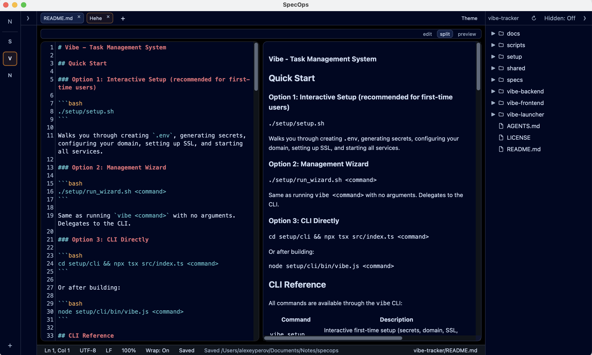
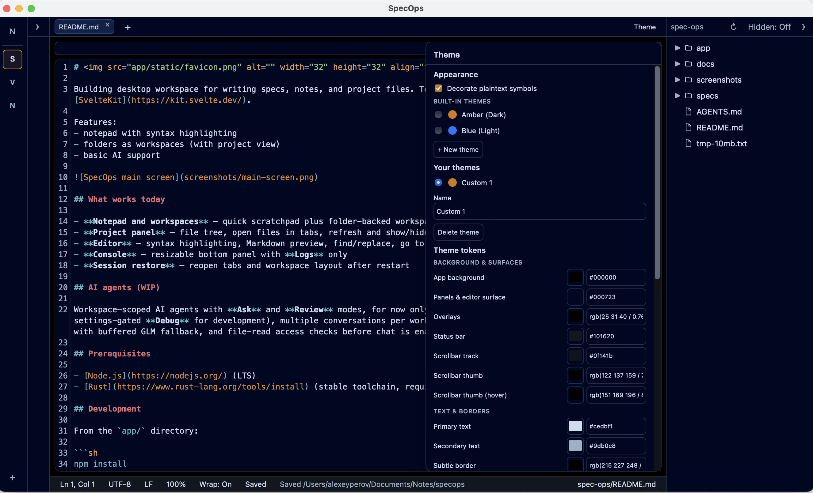
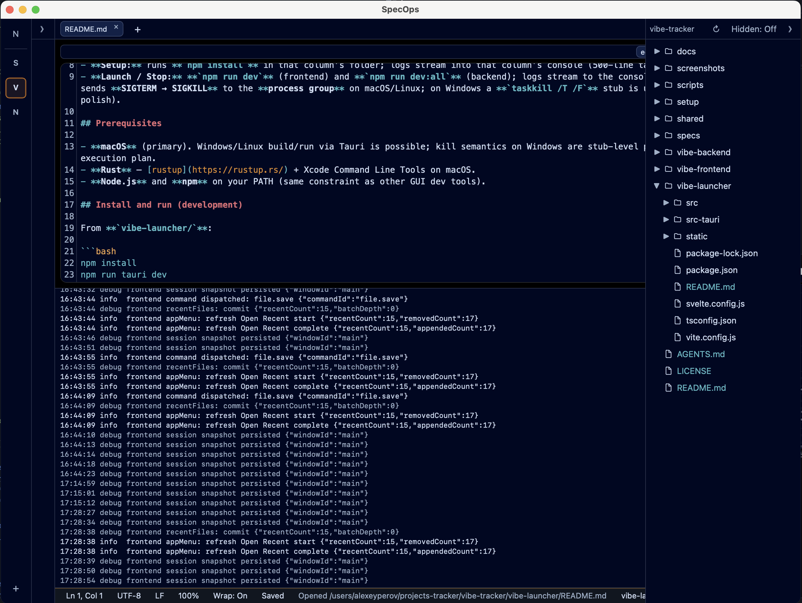

#  SpecOps

Desktop workspace for notes, specs, and project files — with a built-in editor
and optional **OpenCode**-powered workspace sessions (beta). Built with
[Tauri](https://tauri.app/) and [SvelteKit](https://kit.svelte.dev/).

> Under active development. APIs, settings, and on-disk formats may change without migration.

## What works today

- **Editor** — syntax highlighting for Markdown and common code languages; optional **minimap**;
  multi-cursor, code folding, Markdown outline; find/replace with regex, whole-word,
  and case matching in-file and across the project
- **Markdown** preview and edit
- **Folders as workspaces** — multi-root activity rail
- **Project panel** — file tree, drag-and-drop move, context menu (new/rename/delete), live refresh, tabs, show/hide hidden files
- **Version Control** — per-workspace git tab (history, branches, tags, changes, fetch/pull/push) via system `git`
- **Themes**, **multi-window**, **image** preview
- **Console** — resizable bottom panel with logs
- **Workspace sessions (beta)** — OpenCode-powered conversations with tools, permissions, and streaming; off by default, enable under Settings → Dev; see [`docs/beta/`](./docs/beta/)
- **Chat (beta)** — experimental HTTP chat context, off by default; see [`docs/beta/`](./docs/beta/)

## Screenshots

|  |  |
|---------------------------------------------|-------------------------------------------------------|
|  |  |

## Install

- **Releases** — download macOS / Windows installers from [GitHub Releases](https://github.com/AlexeyPerov/spec-ops/releases) (published when a semver tag is pushed; see [CI releases](#ci-releases)).
- **From source** — see [Development](#development) below.

## Workspace sessions (OpenCode)

SpecOps is the UI; **OpenCode** runs models, tools, and session logic. Configure providers and API keys in OpenCode — not in SpecOps HTTP settings.

| Context | Runtime | Configure models / keys |
| --- | --- | --- |
| Workspace sessions | OpenCode (sidecar or URL) | OpenCode (`/connect`, `opencode.json`, `auth.json`) |
| Chat (beta) — `chat-http` (internal context id) | OpenAI-compatible HTTP (off by default) | Enable at **Settings → Dev → Enable Chat (beta)**, then configure **Settings → Dev → Providers** |

### Quick start

1. **Install OpenCode** (dev builds expect `opencode` on `PATH`; release builds bundle a sidecar):
   ```sh
   curl -fsSL https://opencode.ai/install | bash
   ```
2. **Open a workspace folder** in SpecOps (activity rail → add folder).
3. SpecOps starts the OpenCode sidecar **lazily** — on the first **Send** in a session tab, or via **Settings → Workspaces → OpenCode → Check connection**. File editing does not require OpenCode. Disable workspace sessions under **Settings → Workspaces → OpenCode → Use OpenCode for workspace sessions** to use the folder as a plain editor.
4. **Connect a provider** in OpenCode (TUI `/connect`, or see [docs/opencode-integration.md](./docs/opencode-integration.md)).
5. In SpecOps: **Refresh model list** (Settings → Workspaces → OpenCode), then pick agent / provider / model in the session composer.
6. Use the **Sessions** sidebar: create a session, send a prompt. Tool calls and permission prompts appear in the chat panel.

**Sidecar (default)** — port `4096` by default (**Settings → Workspaces → OpenCode → Sidecar port**). **URL mode** — run `opencode serve` yourself and point SpecOps at the base URL.

Troubleshooting, provider examples (OpenRouter, GLM Coding Plan), and integration details: **[docs/opencode-integration.md](./docs/opencode-integration.md)**.  
Chat (beta): **[docs/beta/chat-http-providers.md](./docs/beta/chat-http-providers.md)**.

## What is planned

- Further UI / UX polish
- Extended AI support
- Git post-MVP features

## Prerequisites

- [Node.js](https://nodejs.org/) 24+ (LTS; see [`.nvmrc`](./.nvmrc))
- [Rust](https://www.rust-lang.org/tools/install) (stable toolchain, required by Tauri)
- System [`git`](https://git-scm.com/) on `PATH` for Version Control

## Development

From the `app/` directory, use `npm ci` for a reproducible clean-clone setup:

```sh
npm ci
npm run tauri dev
```

Use `npm install` instead when intentionally changing dependencies or refreshing
`app/package-lock.json`.

This starts the Vite dev server and opens the desktop app. Type-check the frontend with:

```sh
npm run check
```

### Unit tests

From the `app/` directory:

```sh
npm test
```

Watch mode:

```sh
npm run test:watch
```

Tests live next to source as `*.test.ts` under `app/src/`. Rust backend tests from `app/src-tauri/`:

```sh
cargo test
```

If port **1430** is already in use (Vite is pinned to that port), free it and retry:

```sh
kill "$(lsof -t -iTCP:1430 -sTCP:LISTEN)"
npm run tauri dev
```

## Build

From the `app/` directory after installing dependencies, ensure the matching
OpenCode sidecar binary exists (see
[`app/src-tauri/binaries/README.md`](./app/src-tauri/binaries/README.md)), then:

```sh
npm run tauri build
```

Installers and bundles are written to `app/src-tauri/target/release/bundle/`.

### Platform support

| Platform | GitHub release downloads | Test CI | Local source builds |
| --- | --- | --- | --- |
| macOS (Apple silicon and Intel) | Yes — universal build | Yes | Supported |
| Windows (x64) | Yes | Yes | Supported |
| Linux | No published installers | Yes | Buildable with Tauri's Linux prerequisites, but not a supported release target |

The test workflow runs Vitest on macOS, Windows, and Linux; on Linux it also runs
`npm run check`, `cargo test`, and the Markdown link checker. The release
workflow publishes artifacts only for macOS and Windows; Tauri's `targets: "all"`
controls bundle formats for the current build host and does not add a Linux release job.

### CI releases

Push a **semver** tag such as `v1.0.0` or `v1.0.0-beta.1` (optional `+build`
metadata is allowed). The [Release](.github/workflows/release.yml) workflow
rejects non-semver `v*` tags before building, then publishes a universal macOS
bundle and Windows x64 installers as assets on that GitHub release.

Before tagging, keep these version fields in sync:

- `app/package.json` → `version`
- `app/src-tauri/tauri.conf.json` → `version`
- `app/src-tauri/Cargo.toml` → `package.version`

## Docs

| Doc | Audience |
| --- | --- |
| [docs/README.md](./docs/README.md) | Index — users vs contributors |
| [docs/opencode-integration.md](./docs/opencode-integration.md) | Workspace sessions / OpenCode setup |
| [docs/architecture.md](./docs/architecture.md) | Codebase map for contributors |
| [docs/beta/](./docs/beta/) | Experimental Chat (HTTP) lane |
| [CONTRIBUTING.md](./CONTRIBUTING.md) | How to contribute |
| [AGENTS.md](./AGENTS.md) | Rules for coding agents working in this repo |

Product plans and the changelog live under [`specs/`](./specs/) (development material, not end-user docs).

## License

[MIT](./LICENSE)
