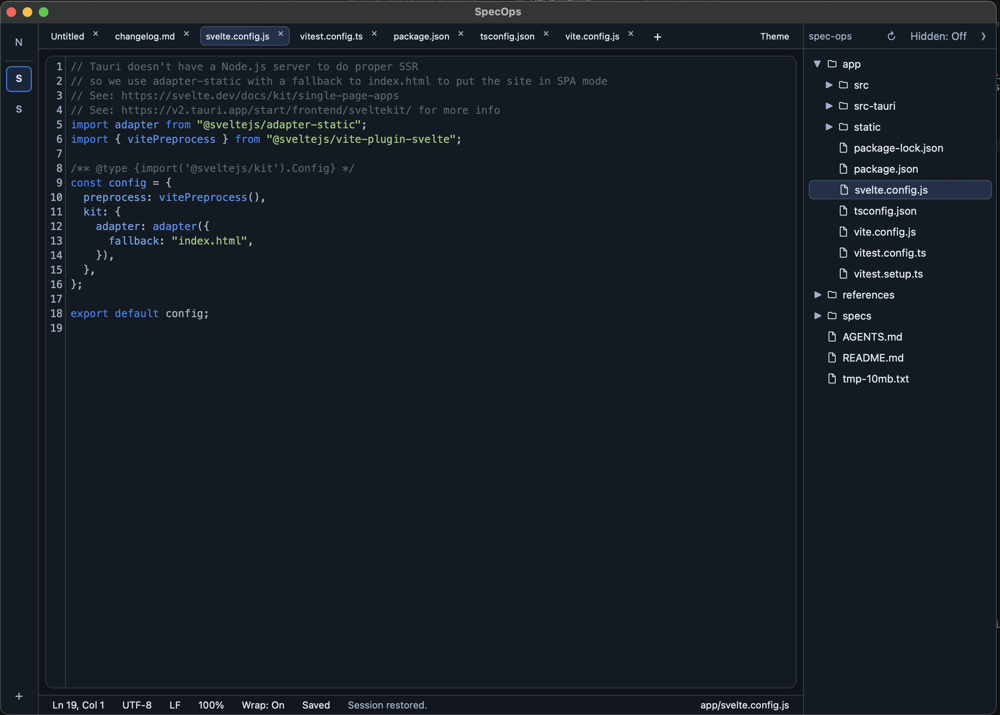

#  SpecOps

Building desktop workspace for writing specs, notes, and project files. Tech: [Tauri](https://tauri.app/) and [SvelteKit](https://kit.svelte.dev/).

Features:
- notepad with syntax highlighting
- folders as workspaces (with project view)
- basic AI support



## What works today

- **Notepad and workspaces** — quick scratchpad plus folder-backed workspaces on the activity rail
- **Project panel** — file tree, open files in tabs, refresh and show/hide hidden files
- **Editor** — syntax highlighting, Markdown preview, find/replace, go to line, unsaved-change diff
- **Console** — resizable bottom panel with **Logs** only
- **Session restore** — reopen tabs and workspace layout after restart

## AI agents (WIP)

Workspace-scoped AI agents with **Ask** and **Review** modes, for now only **GLM** as the production provider (plus settings-gated **Debug** for development), multiple conversations per workspace, retry on failure, streaming on Debug with buffered GLM fallback, and file-read access checks before chat is enabled.

## Prerequisites

- [Node.js](https://nodejs.org/) (LTS)
- [Rust](https://www.rust-lang.org/tools/install) (stable toolchain, required by Tauri)

## Development

From the `app/` directory:

```sh
npm install
npm run tauri dev
```

This starts the Vite dev server and opens the desktop app. Type-check the frontend with:

```sh
npm run check
```

### Unit tests

From the `app/` directory:

```sh
npm test
```

Run tests in watch mode while developing:

```sh
npm run test:watch
```

Tests live next to source as `*.test.ts` files under `app/src/`. Rust backend tests run from `app/src-tauri/`:

```sh
cargo test
```

If port **1430** is already in use (Vite is pinned to that port), free it and retry:

```sh
kill "$(lsof -t -iTCP:1430 -sTCP:LISTEN)"
npm run tauri dev
```

## Build

From the `app/` directory:

```sh
npm install
npm run tauri build
```

Installers and bundles are written to `app/src-tauri/target/release/bundle/`.

On macOS, CI builds a universal binary when you push a semver tag (`v1.0.0`).
