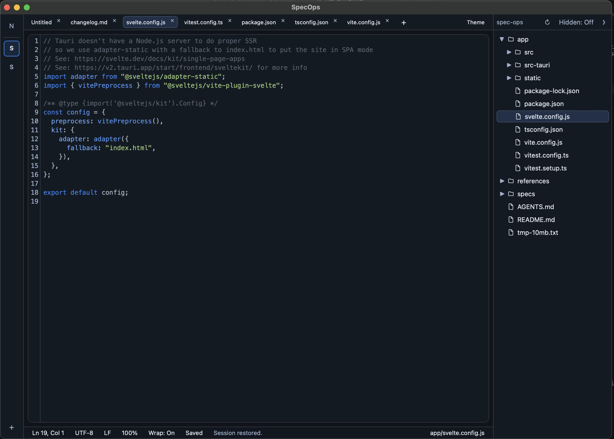
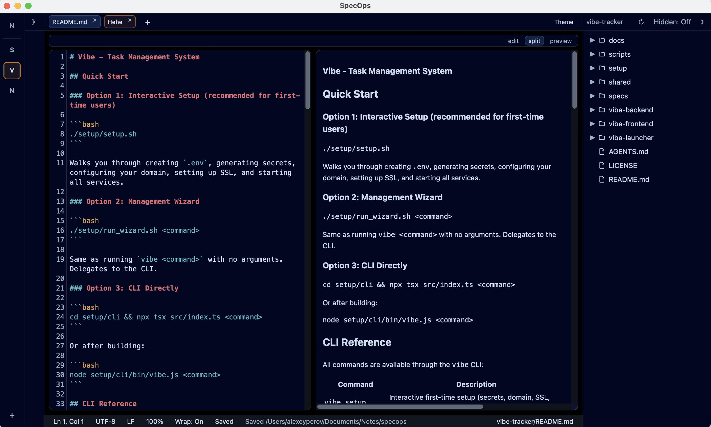
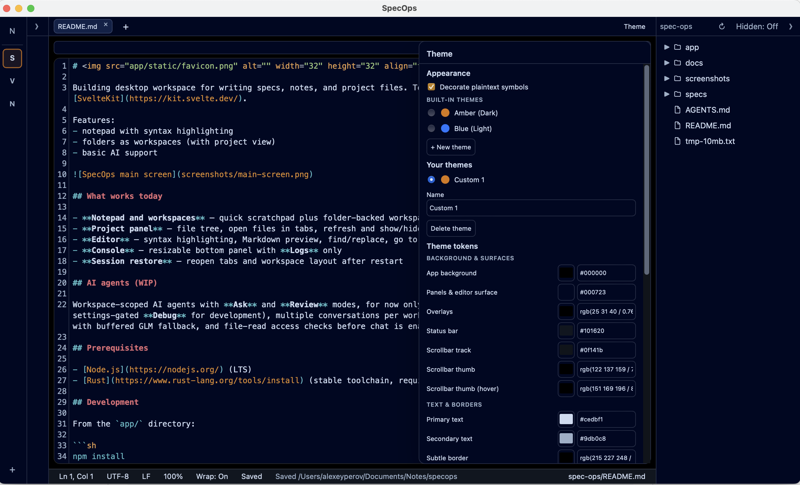
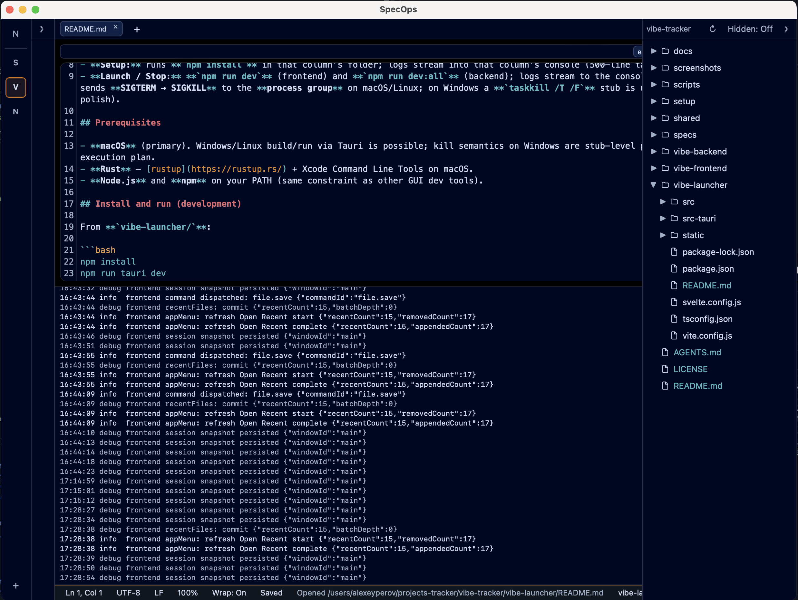

#  SpecOps

Desktop workspace for notes, specs, and project files — with a built-in editor
and **workspace sessions** for coding-agent runtimes (dev preview). Built with
[Tauri](https://tauri.app/) and [SvelteKit](https://kit.svelte.dev/).

> Under active development. APIs, settings, and on-disk formats may change without migration.

## What works today

- **Editor** — syntax highlighting for Markdown and common code languages; optional **minimap**;
  multi-cursor, code folding, Markdown outline; find/replace with regex, whole-word,
  and case matching in-file and across the project
- **Markdown** preview and edit
- **Folders as workspaces** — multi-root activity rail
- **Project panel** — file tree, drag-and-drop move, context menu (new/rename/delete), live refresh, tabs, show/hide hidden files
- **Version Control** — per-workspace git tab (history, branches, tags, changes, fetch/pull/push) via system `git`
- **Themes**, **multi-window**, **image** preview
- **Console** — resizable bottom panel with logs
- **Workspace sessions (dev preview)** — coding-agent conversations with tools, permissions, questions, and streaming, driven through a supervised local Agent Host; off by default, enable under **Settings → Dev**

## Screenshots

|  |  |
|---------------------------------------------|-------------------------------------------------------|
|  |  |

## Install

- **Releases** — download macOS / Windows installers from [GitHub Releases](https://github.com/AlexeyPerov/spec-ops/releases) (published when a semver tag is pushed; see [CI releases](#ci-releases)).
- **From source** — see [Development](#development) below.

## Workspace sessions

One **Sessions** surface per workspace: create independent sessions, pick a
model and mode, and chat with a coding-agent runtime. Sessions bind to their
runtime for life; turns, tools, permissions, questions, and cancellation all
flow through one supervised local **Agent Host** (the WebView never loads agent
SDKs or spawns runtimes).

Currently the deterministic **dev runtime** is registered (no external
dependencies — it exercises the full session lifecycle end to end). Real
runtime adapters — Claude, Codex, OpenCode, Cursor — arrive per the
[roadmap](./specs/ops/roadmap.md).

### Quick start

1. **Open a workspace folder** in SpecOps (activity rail → add folder).
2. Enable sessions under **Settings → Dev → Enable workspace sessions**.
3. Use the **Sessions** sidebar: create a session, pick a model/mode in the
   composer, and send a prompt. The Agent Host starts lazily on first send;
   permission and question prompts appear in the chat panel, and a stuck host
   can be restarted from the session header.

## What is planned

- Further UI / UX polish
- Extended AI support
- Git post-MVP features

## Prerequisites

- [Node.js](https://nodejs.org/) 24+ (LTS; see [`.nvmrc`](./.nvmrc))
- [Rust](https://www.rust-lang.org/tools/install) (stable toolchain, required by Tauri)
- System [`git`](https://git-scm.com/) on `PATH` for Version Control

## Development

From the `app/` directory, use `npm ci` for a reproducible clean-clone setup:

```sh
npm ci
npm run tauri dev
```

Use `npm install` instead when intentionally changing dependencies or refreshing
`app/package-lock.json`.

This starts the Vite dev server and opens the desktop app. Type-check the frontend with:

```sh
npm run check
```

### Unit tests

From the `app/` directory:

```sh
npm test
```

Watch mode:

```sh
npm run test:watch
```

Tests live next to source as `*.test.ts` under `app/src/`. Rust backend tests from `app/src-tauri/`:

```sh
cargo test
```

If port **1430** is already in use (Vite is pinned to that port), free it and retry:

```sh
kill "$(lsof -t -iTCP:1430 -sTCP:LISTEN)"
npm run tauri dev
```

## Build

From the `app/` directory after installing dependencies, then:

```sh
npm run tauri build
```

Installers and bundles are written to `app/src-tauri/target/release/bundle/`.

### Platform support

| Platform | GitHub release downloads | Test CI | Local source builds |
| --- | --- | --- | --- |
| macOS (Apple silicon and Intel) | Yes — universal build | Yes | Supported |
| Windows (x64) | Yes | Yes | Supported |
| Linux | No published installers | Yes | Buildable with Tauri's Linux prerequisites, but not a supported release target |

The test workflow runs Vitest on macOS, Windows, and Linux; on Linux it also runs
`npm run check`, `cargo test`, and the Markdown link checker. The release
workflow publishes artifacts only for macOS and Windows; Tauri's `targets: "all"`
controls bundle formats for the current build host and does not add a Linux release job.

### CI releases

Push a **semver** tag such as `v1.0.0` or `v1.0.0-beta.1` (optional `+build`
metadata is allowed). The [Release](.github/workflows/release.yml) workflow
rejects non-semver `v*` tags before building, then publishes a universal macOS
bundle and Windows x64 installers as assets on that GitHub release.

Before tagging, keep these version fields in sync:

- `app/package.json` → `version`
- `app/src-tauri/tauri.conf.json` → `version`
- `app/src-tauri/Cargo.toml` → `package.version`

## Docs

| Doc | Audience |
| --- | --- |
| [docs/architecture.md](./docs/architecture.md) | Codebase map for contributors |
| [CONTRIBUTING.md](./CONTRIBUTING.md) | How to contribute |
| [AGENTS.md](./AGENTS.md) | Rules for coding agents working in this repo |

Product plans and the changelog live under [`specs/`](./specs/) (development material, not end-user docs).

## License

[MIT](./LICENSE)
