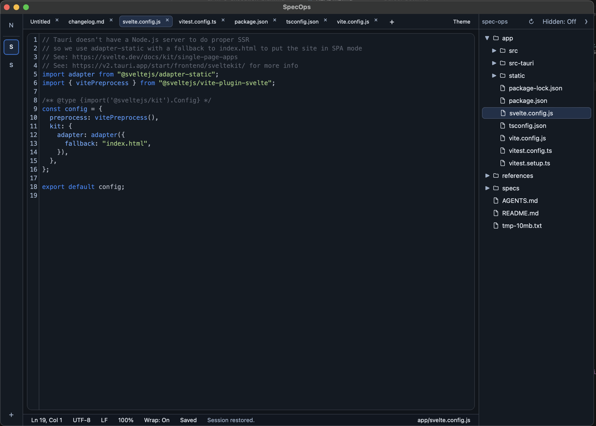
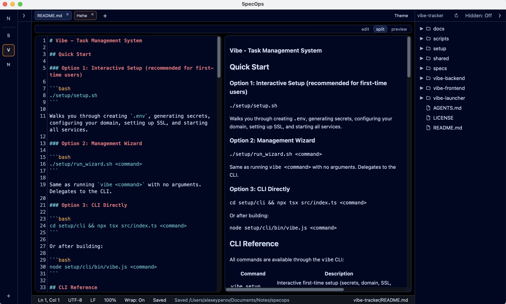
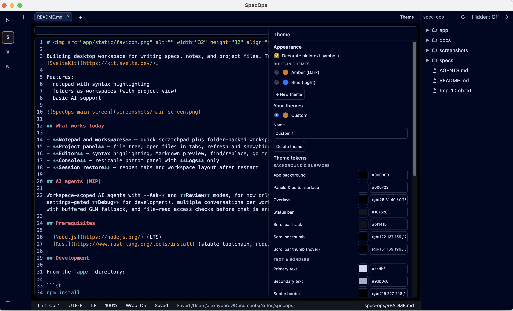
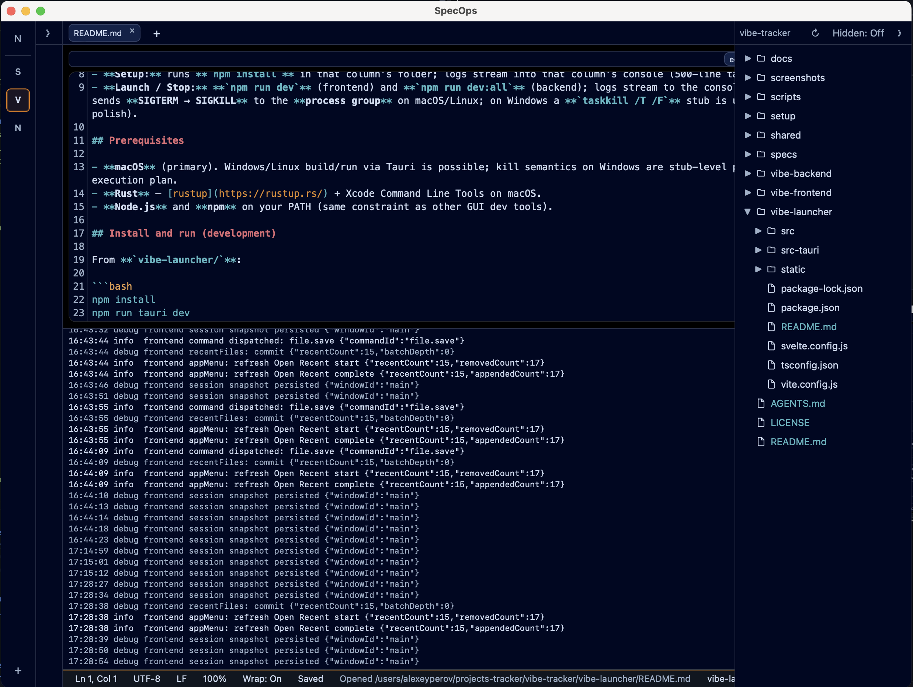

#  SpecOps

Desktop workspace for notes, specs, and project files — with a built-in editor
and **workspace sessions** for coding-agent runtimes (dev preview). Built with
[Tauri](https://tauri.app/) and [SvelteKit](https://kit.svelte.dev/).

> Under active development. APIs, settings, and on-disk formats may change without migration.

## What works today

- **Editor** — syntax highlighting for Markdown and common code languages; optional **minimap**;
  multi-cursor, code folding, Markdown outline; find/replace with regex, whole-word,
  and case matching in-file and across the project
- **Markdown** preview and edit
- **Folders as workspaces** — multi-root activity rail
- **Project panel** — file tree, drag-and-drop move, context menu (new/rename/delete), live refresh, tabs, show/hide hidden files
- **Version Control** — per-workspace git tab (history, branches, tags, changes, fetch/pull/push) via system `git`
- **Themes**, **multi-window**, **image** preview
- **Console** — resizable bottom panel with logs
- **Workspace sessions (dev preview)** — coding-agent conversations with tools, permissions, questions, and streaming, driven through a supervised local Agent Host; off by default, enable under **Settings → Dev**

## Screenshots

|  |  |
|---------------------------------------------|-------------------------------------------------------|
|  |  |

## Install

- **Releases** — historical installers remain on [GitHub Releases](https://github.com/AlexeyPerov/spec-ops/releases). The current optional-agent candidate is blocked pending signed installed and distribution acceptance; see [CI releases](#ci-releases).
- **From source** — see [Development](#development) below.

## Workspace sessions

One **Sessions** surface per workspace: create independent sessions, pick a
model and mode, and chat with a coding-agent runtime. Sessions bind to their
runtime for life; turns, tools, permissions, questions, and cancellation all
flow through one supervised local **Agent Host** (the WebView never loads agent
SDKs or spawns runtimes).

Claude, Codex, OpenCode and Cursor adapters are implemented behind the host.
Optional software is managed separately from account connections and saved native
sessions. Production downloads currently report unavailable until their exact
artifacts, catalog, signing and distribution are approved. The deterministic dev
runtime remains available for source lifecycle verification.

### Quick start

1. **Open a workspace folder** in SpecOps (activity rail → add folder).
2. Enable sessions under **Settings → Dev → Enable workspace sessions**.
3. Use the **Sessions** sidebar: create a session, pick a model/mode in the
   composer, and send a prompt. The Agent Host starts lazily on first send;
   permission and question prompts appear in the chat panel, and a stuck host
   can be restarted from the session header. Restart does not replay the previous
   prompt; the next user action resumes the saved native session.

The base application bundles the editor and host JavaScript, with no Node,
agent executable or SDK/native helper payload. Opening the editor or software
settings does not start the Agent Host or download software. Installed execution
uses authenticated managed components outside the checkout; developer Node/PATH
fallbacks are limited to debug builds. Source no-account controls pass on macOS
Apple silicon. Signed installed/account acceptance remains open. Windows/Linux
agent execution is unsupported pending its own process and distribution evidence.
See [agent software and recovery](docs/agent-software.md).

## What is planned

- Further UI / UX polish
- Extended AI support
- Git post-MVP features

## Prerequisites

- [Node.js](https://nodejs.org/) 24+ (LTS; see [`.nvmrc`](./.nvmrc))
- [Rust](https://www.rust-lang.org/tools/install) (stable toolchain, required by Tauri)
- System [`git`](https://git-scm.com/) on `PATH` for Version Control

## Development

From the `app/` directory, use `npm ci` for a reproducible clean-clone setup:

```sh
npm ci
npm ci --prefix host
npm run tauri dev
```

Use `npm install` instead when intentionally changing dependencies or refreshing
`app/package-lock.json`.

This starts the Vite dev server and opens the desktop editor. For source-only
session controls, explicitly set `SPECOPS_NODE_EXECUTABLE` to the absolute Node 24
executable before starting `tauri dev`; this debug override does not authorize
production installation or account access. Example on macOS/Linux:

```sh
SPECOPS_NODE_EXECUTABLE=/absolute/path/to/node npm run tauri dev
```

Type-check the frontend with:

```sh
npm run check
```

### Unit tests

From the `app/` directory:

```sh
npm test
```

Watch mode:

```sh
npm run test:watch
```

Tests live next to source as `*.test.ts` under `app/src/`. Rust backend tests from `app/src-tauri/`:

```sh
cargo test
```

If port **1430** is already in use (Vite is pinned to that port), free it and retry:

```sh
kill "$(lsof -t -iTCP:1430 -sTCP:LISTEN)"
npm run tauri dev
```

## Build

From the `app/` directory after installing dependencies, then:

```sh
npm run tauri build
```

Installers and bundles are written to `app/src-tauri/target/release/bundle/`.

### Platform support

| Platform | GitHub release downloads | Test CI | Local source builds |
| --- | --- | --- | --- |
| macOS Apple silicon | Current optional-agent candidate not published | Yes | Lean candidate buildable; signed installed release acceptance open |
| macOS Intel / Windows / Linux | Historical downloads do not establish current component support | Frontend/source CI | Source builds require platform prerequisites; agent execution unaccepted |

The current component target is Darwin arm64. No additional component platform is
advertised until its own signed installed/account/process gates pass. Frontend
cross-platform CI does not establish agent support.

### CI releases

A **semver** tag triggers the [Release](.github/workflows/release.yml) workflow,
which builds a Darwin arm64 unsigned/ad-hoc candidate, checks lean inventory and
numeric package budgets, and saves the app archive plus inventory as Actions
artifacts. It does not publish a release. Production publication requires a
reviewed signed/notarized exact artifact, accepted component/catalog identities
and the [selected release record](specs/ops/08-release-gates/release-2026-10-11-components.md).

Use the release helper from the repository root (Node.js 24+, Git on `PATH`):

```sh
# Increase 0.2.0 to 0.2.1, update all version files and changelog, then commit
node scripts/release.mjs bump

# Other version changes
node scripts/release.mjs bump minor
node scripts/release.mjs bump major
node scripts/release.mjs bump 0.3.0

# Push master and a version tag to start the candidate CI build
node scripts/release.mjs build

# Alternatively, build the lean local candidate with build dependencies
node scripts/release.mjs build --local
# Optional Tauri arguments
node scripts/release.mjs build --local --bundles app
```

`bump` synchronizes the npm package and lockfile, Tauri config, Cargo manifest
and Cargo lockfile. It adds a dated changelog entry and commits the version
change on `master`; it does not push or start a release build. `build` pushes
`master` and an annotated version tag atomically to `origin`, which triggers
the candidate Release workflow. Monitor progress in [GitHub Actions](https://github.com/AlexeyPerov/spec-ops/actions/workflows/release.yml).

Both release commands require a clean checkout on `master`. `build` refuses an
already published tag and requires local `master` to include remote `master`.
For another published release, bump the version first. If a push fails, rerun
`build`; a local tag is reused only when it points to the current commit.
If the version commit fails (for example, a commit hook fails), the updated
files stay staged so you can resolve the failure and commit them.
`build --local` uses the current checkout without committing, pushing or
creating a tag. The script resolves repository paths itself, so it also works
when invoked by its path from another directory.
On macOS, a successful local DMG build opens the finished installer in Finder.
It stays mounted until you eject it; the temporary window shown during packaging
still closes when the builder finishes configuring the disk image.

## Docs

| Doc | Audience |
| --- | --- |
| [docs/architecture.md](./docs/architecture.md) | Codebase map for contributors |
| [CONTRIBUTING.md](./CONTRIBUTING.md) | How to contribute |
| [AGENTS.md](./AGENTS.md) | Rules for coding agents working in this repo |

Product plans and the changelog live under [`specs/`](./specs/) (development material, not end-user docs).

## License

[MIT](./LICENSE)

Agent software is managed in **Settings → Software** or from **Manage selected software** in Sessions. Review the finite versions/dependencies/download/disk plan before explicitly installing. Account connection and session continuation remain separate explicit actions. Distribution is currently unavailable until release approval; see [agent software and recovery](docs/agent-software.md).
