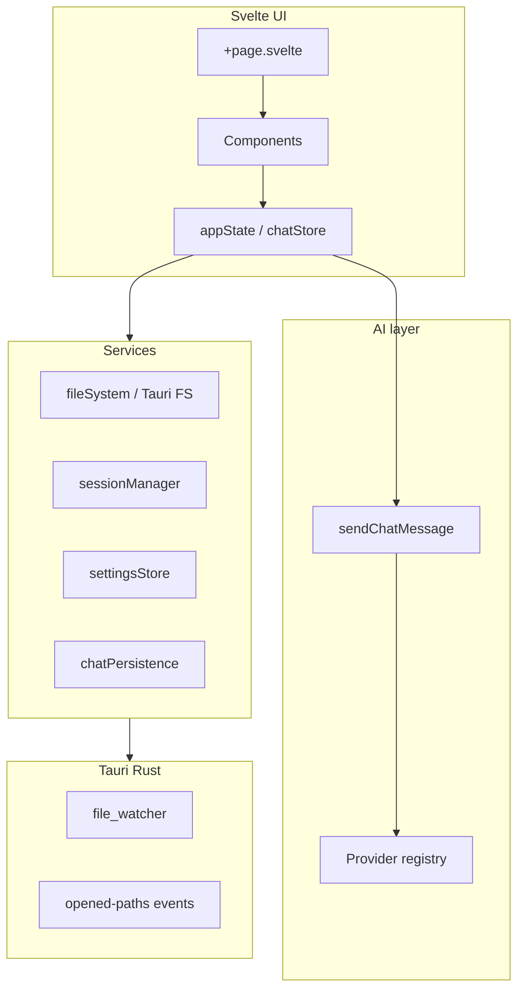

# SpecOps architecture

SpecOps is a desktop workspace app for specs, notes, and project files. The UI is a **SvelteKit** frontend; the shell is **Tauri 2** (Rust) with filesystem, dialogs, logging, and a small set of custom commands.

## Repository layout

| Path | Role |
| --- | --- |
| `app/` | Frontend (Svelte 5, Vite) and Tauri project root (`package.json`, `src-tauri/`) |
| `app/src/routes/` | SvelteKit routes; `+page.svelte` is the main application shell |
| `app/src/lib/domain/` | Shared types and pure helpers (`contracts.ts`) |
| `app/src/lib/state/` | Writable stores and domain orchestration (`appState`, `chatStore`) |
| `app/src/lib/services/` | I/O, persistence, platform, file watching, session |
| `app/src/lib/ai/` | Chat providers, modes, send pipeline |
| `app/src/lib/components/` | UI components |
| `app/src/lib/commands/` | Menu and keyboard command registry |
| `app/src-tauri/` | Rust: file watcher, macOS open-with, logging plugins |
| `specs/` | Product specs, execution plans, changelog |
| `docs/` | Architecture and integration docs (this folder) |

Unit tests are colocated as `*.test.ts` next to source. Run them from `app/` with `npm test`.

## Runtime stack

Most product logic lives in TypeScript. Rust is intentionally thin: watch paths, enqueue files opened from the OS, and plugin wiring.

## Domain model

Types live in `app/src/lib/domain/contracts.ts`. Important concepts:

### Contexts and workspaces

- **`notepad`** — scratch context without a folder root.
- **`ws-{n}`** — folder-backed workspace (`WorkspaceEntry` with `rootPath`).

Each context has a **`ContextSnapshot`**: `documents[]` and `session` (tabs, selection, layout, last active agent).

`appState` holds `WindowContextState` (notepad + workspace list + `activeContextId`). Active-context `documents` and `session` live only inside each `ContextSnapshot`; use `getActiveDocuments()` / `getActiveSession()` or `getActiveContextSnapshot(state)` for reads.

### Documents and tabs

- **`DocumentState`** — editor buffer, dirty flag, disk fingerprint, markdown view mode, etc.
- **`TabState`** — `file` (links `documentId`) or `agent` (links `agentId`).

File open/save flows go through `appState` and services (`fileSystem`, `openFileGate`, `externalFileChanges`).

### AI agents (workspace-scoped)

- One **agent** per conversation; many agents per workspace.
- **`chatStore`** holds in-memory threads keyed by workspace root path (phase-1 baseline; context-id scoping is planned for later phases).
- Threads persist under the app data dir (see [Persistence](#persistence)).
- Modes: **`ask`** and **`review`** (system prompts in `app/src/lib/ai/modes/builtins.ts`).

Provider integration is documented in [providers.md](./providers.md).

## State layer

### `appState` (`app/src/lib/state/appState.ts`)

Single source of truth for:

- Active context, documents, tabs, editor chrome (zoom, wrap, find/replace)
- **`AppSettingsState`** (including Connections/HTTP settings and in-memory API key)
- Theme (builtin + custom), recent files

Mutations are methods on the exported store object (e.g. `openDocument`, `setProviderApiKey`, workspace close with dirty prompts).

Implementation is split into colocated modules under `app/src/lib/state/appState/`:

| Module | Role |
| --- | --- |
| `contextHelpers.ts` | Context snapshots, workspace lookup, document path lookup, ID counters |
| `documentHelpers.ts` | Build/normalize document helpers |
| `tabHelpers.ts` | Tab reorder and bulk-close helpers |
| `themeController.ts` | Theme persistence, DOM application, custom-theme transforms |
| `settingsSlice.ts` | Settings defaults and provider/catalog mutators |
| `documentTabsSlice.ts` | Tab CRUD, agent tabs, file open/transfer, document mutators |
| `workspaceContextsSlice.ts` | Context switch, workspace open/close, session restore/snapshot |

### `chatStore` (`app/src/lib/state/chatStore.ts`)

Workspace-scoped chat:

- Agent index, per-agent `ChatThreadSnapshot`, runtime (generating, last error)
- Access preflight (`runAccessPreflight`) — provider capabilities + workspace path readability
- Provider/model switches append **`ChatSystemEvent`** messages to the thread

Implementation is split into colocated modules under `app/src/lib/state/chatStore/`:

| Module | Role |
| --- | --- |
| `agents.ts` | Agent index, drafts, titles, agent CRUD helpers |
| `threads.ts` | Thread clone/patch, messages, metadata, system events, compaction |
| `runtime.ts` | Generation state, placeholders, retry, cancel |
| `access.ts` | Preflight, access loss messages, capability checker wiring |
| `workspace.ts` | Per-root workspace state patch helpers |
| `threadHelpers.ts`, `types.ts` | Shared thread types and pure helpers |

Chat providers are registered at startup via `initializeChatProviders()` in `app/src/lib/ai/providers/bootstrap.ts` (called from `+page.svelte` after settings and provider API key load).

## Send pipeline (high level)

1. UI calls `sendChatMessage` / `retryLastChatTurn` (`app/src/lib/ai/sendChatMessage.ts`).
2. Validates provider (debug enabled, HTTP configured), model catalog, access preflight.
3. Appends user message; begins turn; builds **`ProviderRequestPayload`** via `buildThreadProviderRequest`.
4. **`streamProviderMessage`** (`chatSend.ts`) — uses `streamMessage` when available (Debug + HTTP SSE), else buffered `sendMessage`.
5. Updates assistant placeholder; compacts thread if needed; debounced persist.

Shared prompt shape is defined in `app/src/lib/ai/providers/types.ts` so Debug and HTTP stay aligned.

## Commands and menus

- **`AppCommandId`** — stable command ids in `contracts.ts`.
- **`commands/registry.ts`** — command definitions with per-platform `binding.mac` / `binding.windows`; `expandPlatformKeymaps()` builds platform keymaps from those bindings (no duplicated Meta/Ctrl maps). Menu initialization and dispatch run from `+page.svelte` and the native menu.

Prefer adding behavior through a command id when it is user-facing and needs shortcuts or menu entries.

## Persistence

All app data is under Tauri **`appDataDir()/spec-ops`** (`ensureSpecOpsDataDir`).

| File / area | Contents |
| --- | --- |
| `settings.json` | Editor, external files, `providerSettings` (HTTP + Debug), `providerModelCatalogs` (not API keys) |
| `provider-secrets.json` | Provider API keys keyed by `ChatProviderId` (`providerSecretsStore.ts`: `loadProviderApiKey` / `saveProviderApiKey`) |
| `session.json` | Window layouts, tabs, contexts (v2; no v1 migration) |
| `themes.json` | Active and custom themes |
| `chat/{hash}/` | Per-workspace agent index and thread JSON |

Session and chat writes are debounced. The project **does not** add backward-compatible migrations for persisted data unless explicitly requested (see agent rules below).

## Tauri backend

`app/src-tauri/src/lib.rs`:

- Plugins: dialog, fs, log, opener
- **`file_watcher`** — sync watch paths with frontend
- macOS **`RunEvent::Opened`** — open files/folders from Finder; emits `spec-ops/app/opened-paths`

Custom commands: `take_pending_opened_paths`, `sync_file_watcher_paths`.

## UI composition

`+page.svelte` wires (Svelte 5 runes: `$state`, `$derived`, `$effect`):

- Activity rail (notepad / workspaces)
- Project panel, editor + tab bar, agents sidebar, chat panel
- Settings dialog, theme pane, console (logs only)

### Settings dialog tab registry

Tab ids and sidebar labels live in **`SETTINGS_TABS`** (`app/src/lib/services/settingsDialogUi.ts`), not as hardcoded unions scattered across the dialog. Each entry is a `SettingsTabDefinition` (`id`, `label`, `panelAriaLabel`). Current tabs: `editor`, `shortcuts`, `connections`, `debugAi`, `debugAgent`. Sidebar sections: **Chats** (`connections`, `debugAi`) and **Workspaces** (`debugAgent`). `SettingsDialog.svelte` renders sidebar and panels from registry order; `openSettingsDialog(tab)` opens a specific tab (used by ChatPanel CTAs and commands).

Routing helpers: `editorRouting.ts` (file vs agent tab), `workspaceAgentSession.ts` (agent tab lifecycle).

Editor: CodeMirror via `EditorSurface.svelte` (Svelte 5 runes), language detection in `editorLanguage.ts`. `TabBar.svelte` and `TabBarContextMenu.svelte` also use runes.

Chat panel subcomponents (extracted from `ChatPanel.svelte`):

| Component | Role |
| --- | --- |
| `ChatMessageList.svelte` | Message rendering, review sections, system events, compaction notice |
| `ChatComposer.svelte` | Draft input, send/retry, provider/mode/model selectors |
| `ChatBlockedState.svelte` | Access blocked and provider config alarm UI |

Tab bar subcomponents (extracted from `TabBar.svelte`):

| Component / module | Role |
| --- | --- |
| `TabBarContextMenu.svelte` | Tab context menu UI and actions |
| `tabDragController.ts` | Pointer drag state machine, reorder, tear-off threshold |

## Testing conventions

- **Vitest** for TypeScript; tests assert real behavior (persistence codecs, send pipeline, provider adapters).
- Reset helpers exist for global singletons: `resetChatProvidersForTests`, `resetChatProviderRegistryForTests`, `resetSessionManagerForTests`, etc.
- Validation suites under `app/src/lib/state/chatM*.validation.test.ts` encode milestone acceptance criteria.

After structural changes, run `npm test` and `npm run check` from `app/`.

## Recommendations for coding agents

These extend [AGENTS.md](../AGENTS.md) with architecture-specific guidance.

### Scope and storage

- **Changelog** — Record user-visible or structural changes in `specs/changelog.md` with dated entries.
- **No `references/` edits** — That folder is gitignored examples only.
- **No unsolicited migrations** — Prefer breaking simplification of codecs over compatibility shims for `session.json`, chat files, or settings.

### Where to change things

| Task | Start here |
| --- | --- |
| New persisted field | `contracts.ts` → normalize in store/service → tests |
| New menu action | `AppCommandId` + `registry.ts` + handler in `+page.svelte` or `appState` |
| Chat behavior | `sendChatMessage.ts`, `chatStore.ts`, provider adapter under `ai/providers/` |
| New LLM provider | Implement `ChatProvider`, register in `bootstrap.ts`, settings UI, catalog in `providerModelCatalog.ts` |
| File on disk | `services/fileSystem.ts` or Tauri FS; keep paths normalized via `diskFingerprint` / workspace paths helpers |

### Patterns to preserve

1. **Domain types in `contracts.ts`** — Avoid duplicating shapes in components.
2. **Provider-agnostic prompts** — Build `ProviderRequestPayload` once; adapters map to vendor APIs (see `openAiChatMessages.ts`).
3. **Secrets separate from settings** — API keys go in `provider-secrets.json`, not `settings.json` or chat thread files.
4. **User-facing errors** — Throw `ChatProviderError` with `userMessage` in providers; map HTTP/status in one place per provider.
5. **Svelte 5** — Shell components (`+page.svelte`, `TabBar`, `EditorSurface`) use runes; match that style in new `.svelte` work. Load Svelte skills/MCP when editing `.svelte` files.
6. **Minimal Rust** — Prefer implementing features in TypeScript unless OS integration requires native code.

### Avoid

- Attaching editor selection or console logs to AI context (not in MVP scope per README).
- Implementing `cursor` provider without a full plan (id exists in types/catalog for future work).
- Enabling HTTP streaming in the UI without implementing provider `streamMessage` and SSE parsing end-to-end.

### Related docs

- [providers.md](./providers.md) — HTTP provider integration, used vs unused endpoints
- [README.md](../README.md) — product scope and dev commands
- `specs/` — execution plans and requirements
