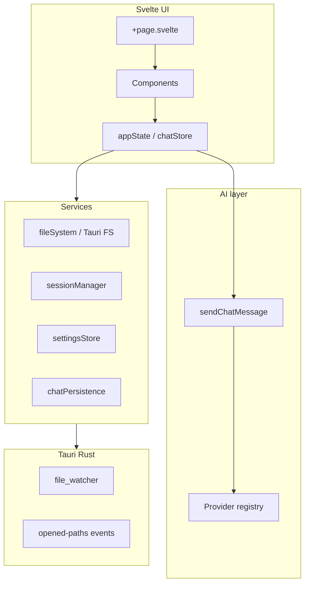

# SpecOps architecture

SpecOps is a desktop workspace app for specs, notes, and project files. The UI is a **SvelteKit** frontend; the shell is **Tauri 2** (Rust) with filesystem, dialogs, logging, and a small set of custom commands.

## Repository layout

| Path | Role |
| --- | --- |
| `app/` | Frontend (Svelte 5, Vite) and Tauri project root (`package.json`, `src-tauri/`) |
| `app/src/routes/` | SvelteKit routes; `+page.svelte` is the main application shell |
| `app/src/lib/domain/` | Shared types and pure helpers (`contracts.ts` barrel over `document.ts`, `workspace.ts`, `settings.ts`, `chat.ts`, `commands.ts`, `persistence.ts`) |
| `app/src/lib/state/` | Writable stores and domain orchestration (`appState`, `chatStore`) |
| `app/src/lib/services/` | I/O, persistence, platform, file watching, session |
| `app/src/lib/ai/` | Chat providers, modes, send pipeline, OpenCode workspace backend |
| `app/src/lib/git/` | Version Control (system `git` via Tauri) — independent of OpenCode |
| `app/src/lib/editor/` | Editor helpers (e.g. minimap extension) |
| `app/src/lib/components/` | UI components (including `Git*` panels) |
| `app/src/lib/commands/` | Menu and keyboard command registry |
| `app/src-tauri/` | Rust: file watcher, git subprocess, macOS open-with, logging plugins |
| `docs/` | Stable product / integration docs (this folder) — see [README.md](./README.md) |
| `specs/` | Product specs, execution plans, changelog (development material) |
| `CONTRIBUTING.md` / `AGENTS.md` | Human and agent contribution rules |

Unit tests are colocated as `*.test.ts` next to source. Run them from `app/` with `npm test`.

### Module size conventions (M6)

Production modules should stay **≤500 lines** where practical; **≤600** is acceptable for cohesive UI shells (`+page.svelte`, `SettingsDialog.svelte`). Test files should stay **≤600 lines** and mirror the production module they cover.

When a file grows past those limits, split along existing domain boundaries and colocate new files next to the parent module:

| Area | Split pattern |
| --- | --- |
| Settings UI | One panel per file under `components/settings/` |
| App shell | `AppShell.svelte`, `appShellEffects.ts`, handler modules under `services/` |
| State slices | `*Slice.ts` per concern (`documentTabsSlice`, `documentContentSlice`, `providerSettingsSlice`, …) |
| `chatStore` | `threadMessages.ts`, `threadMetadata.ts`, `threadProviderSelection.ts`, `agents.ts` |
| Commands | `definitions.ts` + `handlers/{app,file,workspace,edit,view}.ts`; `registry.ts` dispatches only |
| Services | Codecs/paths/policy in sibling modules (`chatPersistenceCodec.ts`, `sessionSnapshotCodec.ts`, `externalFileReloadPolicy.ts`, …) |
| Tests | Match production folders (`appState/*.test.ts`, `chatStore/*.test.ts`, `commands/handlers/*.test.ts`); avoid import-only aggregator test files that duplicate `vi.mock` scopes |

Re-export from the original entry point when splitting to limit import churn (`contracts.ts`, `registry.ts`, `sendChatMessage.ts`, `sessionManager.ts`).

## Runtime stack

Most product logic lives in TypeScript. Rust is intentionally thin: watch paths, enqueue files opened from the OS, and plugin wiring.

## Domain model

Types live in `app/src/lib/domain/contracts.ts`. Important concepts:

### Contexts and workspaces

- **`notepad`** — scratch context without a folder root.
- **`ws-{n}`** — folder-backed workspace (`WorkspaceEntry` with `rootPath`).

Each context has a **`ContextSnapshot`**: `documents[]` and `session` (tabs, selection, layout, last active agent).

`appState` holds `WindowContextState` (notepad + workspace list + `activeContextId`). Active-context `documents` and `session` live only inside each `ContextSnapshot`; use `getActiveDocuments()` / `getActiveSession()` or `getActiveContextSnapshot(state)` for reads.

### Documents and tabs

- **`DocumentState`** — editor buffer, dirty flag, disk fingerprint, markdown view mode, etc.
- **`TabState`** — `file` (links `documentId`) or `session` (links `sessionId`).

File open/save flows go through `appState` and services (`fileSystem`, `openFileGate`, `externalFileChanges`).

### Workspace sessions (workspace-scoped)

- One **session** per conversation; many sessions per workspace. (OpenCode **agent** = persona/config only — see [opencode-integration.md](./opencode-integration.md).)
- **`chatStore`** holds in-memory threads keyed by workspace root path (phase-1 baseline; context-id scoping is planned for later phases).
- Threads persist under the app data dir (see [Persistence](#persistence)).
- Modes: **`ask`** and **`review`** (system prompts in `app/src/lib/ai/modes/builtins.ts`).

HTTP Chat (beta) provider integration is documented in [beta/chat-http-providers.md](./beta/chat-http-providers.md). Workspace agents use OpenCode — see [opencode-integration.md](./opencode-integration.md).

## State layer

### `appState` (`app/src/lib/state/appState.ts`)

Single source of truth for:

- Active context, documents, tabs, editor chrome (zoom, wrap, find/replace)
- **`AppSettingsState`** (including Connections/HTTP settings and in-memory API key)
- Theme (builtin + custom), recent files

Mutations are methods on the exported store object (e.g. `openDocument`, `setProviderApiKey`, workspace close with dirty prompts).

Implementation is split into colocated modules under `app/src/lib/state/appState/`:

| Module | Role |
| --- | --- |
| `contextHelpers.ts` | Context snapshots, workspace lookup, document path lookup, ID counters |
| `documentHelpers.ts` | Build/normalize document helpers |
| `tabHelpers.ts` | Tab reorder and bulk-close helpers |
| `themeController.ts` | Theme persistence, DOM application, custom-theme transforms, system color-scheme (`prefers-color-scheme`) subscription for auto mode |
| `settingsSlice.ts` | Settings composer; composes `providerSettingsSlice`, `chatModesSettingsSlice`, `logSettingsSlice` |
| `documentTabsSlice.ts` | Tab lifecycle; composes `documentContentSlice`, `tabTransferSlice` |
| `workspaceContextsSlice.ts` | Context switch, workspace open/close, session restore/snapshot |

### `chatStore` (`app/src/lib/state/chatStore.ts`)

Workspace-scoped chat:

- Agent index, per-agent `ChatThreadSnapshot`, runtime (generating, last error)
- Access preflight (`runAccessPreflight`) — for Chat context: provider capabilities; for Workspace context: OpenCode backend readiness + workspace path readability
- Provider/model switches append **`ChatSystemEvent`** messages to the thread

Implementation is split into colocated modules under `app/src/lib/state/chatStore/`:

| Module | Role |
| --- | --- |
| `agents.ts` | Agent index, drafts, titles, agent CRUD helpers |
| `threads.ts` | Slice composer; delegates to `threadMessages.ts`, `threadMetadata.ts`, `threadProviderSelection.ts` |
| `runtime.ts` | Generation state, placeholders, retry, cancel |
| `access.ts` | Preflight, access loss messages, capability checker wiring |
| `workspace.ts` | Per-root workspace state patch helpers |
| `threadHelpers.ts`, `types.ts` | Shared thread types and pure helpers |

Chat providers are registered at startup via `initializeChatProviders()` in `app/src/lib/ai/providers/bootstrap.ts` (called from `+page.svelte` after settings and provider API key load).

## Send pipeline (high level)

1. UI calls `sendChatMessage` / `retryLastChatTurn` (`app/src/lib/ai/sendChatMessage.ts`).
2. **Chat context:** validates provider (debug enabled, HTTP configured), model catalog, access preflight. **Workspace context:** validates OpenCode backend readiness and model availability via OpenCode catalog.
3. Appends user message; begins turn; builds **`ProviderRequestPayload`** via `buildThreadProviderRequest`.
4. **`streamProviderMessage`** (`chatSend.ts`) — uses `streamMessage` when available (Debug + HTTP SSE), else buffered `sendMessage`.
5. Updates assistant placeholder; compacts thread if needed; debounced persist.

Shared prompt shape is defined in `app/src/lib/ai/providers/types.ts` so Debug and HTTP stay aligned.

## Commands and menus

- **`AppCommandId`** — stable command ids in `contracts.ts`.
- **`commands/definitions.ts`** — static command metadata and bindings.
- **`commands/handlers/`** — grouped handler maps (`app`, `file`, `workspace`, `edit`, `view`).
- **`commands/registry.ts`** — merges handlers, `dispatchCommand`, keymap lookup via `commandBindingRuntime.ts`. Menu initialization and dispatch run from `+page.svelte` and the native menu.

Prefer adding behavior through a command id when it is user-facing and needs shortcuts or menu entries.

## Persistence

All app data is under Tauri **`appDataDir()/spec-ops`** (`ensureSpecOpsDataDir`).

| File / area | Contents |
| --- | --- |
| `settings.json` | Editor, external files, `providerSettings` (HTTP + Debug), `providerModelCatalogs` (not API keys) |
| `provider-secrets.json` | Provider API keys keyed by `ChatProviderId` (`providerSecretsStore.ts`: `loadProviderApiKey` / `saveProviderApiKey`) |
| `session.json` | Window layouts, tabs, contexts (v2; no v1 migration) |
| `theme.json` | Theme mode (`auto`/`manual`) plus separate dark/light theme refs (used by `auto`), a single `manualTheme` ref (pinned by `manual`), and custom themes (v2 schema). `auto` follows the OS `prefers-color-scheme` media query, switching between the dark and light theme. Legacy v1 files (single `activeTheme`) and the pre-theme.json `settings.json` `theme` value are defensively re-seeded into the matching dark/light slot on load (not migrated). Read-only preset catalog (daylerees imports) ships in-app, not on disk |
| `chat/{hash}/` | Per-workspace session index (`index.json`, `sessions` envelope) and per-session thread JSON (`{sessionId}.json`). M16 renamed the on-disk envelope key from `agents` → `sessions` and the in-memory id from `agentId` → `sessionId`; pre-M16 `chat/{hash}/` folders are abandoned (no migration — pre-release). |

Session and chat writes are debounced. The project **does not** add backward-compatible migrations for persisted data unless explicitly requested (see agent rules below).

## Tauri backend

`app/src-tauri/src/lib.rs`:

- Plugins: dialog, fs, log, opener
- **`file_watcher`** — sync watch paths with frontend
- **`git`** — system `git` subprocess layer for Version Control (askpass, cancel, commit helpers)
- macOS **`RunEvent::Opened`** — open files/folders from Finder; emits `spec-ops/app/opened-paths`

Custom commands include `take_pending_opened_paths`, `sync_file_watcher_paths`, and the `git::*` command set.

## UI composition

`+page.svelte` wires (Svelte 5 runes: `$state`, `$derived`, `$effect`):

- Activity rail (notepad / workspaces)
- Project panel, editor + tab bar, **sessions** sidebar, chat panel
- Version Control view tab (per workspace; system `git`)
- Settings dialog, theme pane, console (logs only)

### Settings dialog

Tab ids and sidebar labels live in **`SETTINGS_TABS`** / `buildSettingsSidebar` (`app/src/lib/services/settingsDialogUi.ts`). Treat that module as the source of truth for tab inventory — do not duplicate the full list here.

High-level layout:

- Top-level: **Editor**, **Shortcuts**, **Appearance**, **Version Control**
- **Dev** — Chat (beta) master toggle, **Logs**; **Chats** subtree only when `chatHttp.enabled`
- **Workspaces** — OpenCode (connection, config, providers, MCP, agents, permissions, …)

`openSettingsDialog(tab)` resolves the requested tab against the chat-http beta gate — gated tabs redirect to `dev` when the beta is off.

Routing helpers: `editorRouting.ts` (file vs session vs view tabs), `workspaceAgentSession.ts` (session tab lifecycle).

Editor: CodeMirror via `EditorSurface.svelte` (Svelte 5 runes), language detection in `editorLanguage.ts`, optional minimap via `editor/editorMinimap.ts`.

Chat panel subcomponents:

| Component | Role |
| --- | --- |
| `ChatMessageList.svelte` | Message rendering, review sections, system events, compaction notice |
| `ChatComposer.svelte` | Draft input, send/retry, provider/mode/model selectors |
| `ChatBlockedState.svelte` | Access blocked and provider config alarm UI |

Tab bar: `TabBarContextMenu.svelte`, `tabDragController.ts` (reorder / tear-off).

## Testing conventions

- **Vitest** for TypeScript; tests assert real behavior (persistence codecs, send pipeline, provider adapters).
- Reset helpers exist for global singletons: `resetChatProvidersForTests`, `resetChatProviderRegistryForTests`, `resetSessionManagerForTests`, etc.
- Validation suites under `app/src/lib/state/chatM*.validation.test.ts` encode milestone acceptance criteria.

After structural changes, run `npm test` and `npm run check` from `app/`.

## Recommendations for coding agents

These extend [AGENTS.md](../AGENTS.md) with architecture-specific guidance.

### Scope and storage

- **Changelog** — Record user-visible or structural changes in `specs/changelog.md` with dated entries.
- **No `references/` edits** — That folder is gitignored examples only.
- **No unsolicited migrations** — Prefer breaking simplification of codecs over compatibility shims for `session.json`, chat files, or settings.

### Where to change things

| Task | Start here |
| --- | --- |
| New persisted field | `contracts.ts` → normalize in store/service → tests |
| New menu action | `AppCommandId` + `registry.ts` + handler in `+page.svelte` or `appState` |
| Workspace session / OpenCode | `workspaceAgentBackend.ts`, `chatStore`, `opencodeSidecar.ts` |
| Chat (beta) HTTP behavior | `sendChatMessage.ts`, `chatStore.ts`, provider adapter under `ai/providers/` |
| New HTTP LLM provider (beta) | Implement `ChatProvider`, register in `bootstrap.ts`, settings UI, catalog in `providerModelCatalog.ts` |
| Version Control / git | `app/src/lib/git/`, `Git*` components; keep **zero** OpenCode coupling |
| File on disk | `services/fileSystem.ts` or Tauri FS; keep paths normalized via `diskFingerprint` / workspace paths helpers |

### Patterns to preserve

1. **Domain types in `contracts.ts`** — Avoid duplicating shapes in components.
2. **Provider-agnostic prompts (Chat beta)** — Build `ProviderRequestPayload` once; adapters map to vendor APIs (see `openAiChatMessages.ts`).
3. **Secrets separate from settings** — API keys go in `provider-secrets.json`, not `settings.json` or chat thread files.
4. **User-facing errors** — Throw `ChatProviderError` with `userMessage` in providers; map HTTP/status in one place per provider.
5. **Svelte 5** — Shell components (`+page.svelte`, `TabBar`, `EditorSurface`) use runes; match that style in new `.svelte` work. Load Svelte skills/MCP when editing `.svelte` files.
6. **Minimal Rust** — Prefer TypeScript unless OS integration requires native code (file watcher, git subprocess, open-with).
7. **Git ↔ OpenCode isolation** — Version Control must not depend on the OpenCode sidecar or workspace-agent backend.

### Avoid

- Attaching editor selection or console logs to AI context unless a planned feature explicitly requires it.
- Implementing a `cursor` provider without a full plan (id may exist in types/catalog for future work).
- Enabling HTTP streaming in the UI without implementing provider `streamMessage` and SSE parsing end-to-end.
- Coupling Version Control UI or git commands to OpenCode health / `file.status`.

### Related docs

- [README.md](./README.md) — docs index (users vs contributors)
- [opencode-integration.md](./opencode-integration.md) — workspace agents / OpenCode
- [beta/chat-http-providers.md](./beta/chat-http-providers.md) — HTTP Chat (beta) providers
- [../README.md](../README.md) — product scope and dev commands
- [../CONTRIBUTING.md](../CONTRIBUTING.md) — contribution workflow
- `specs/` — execution plans, backlog, changelog
