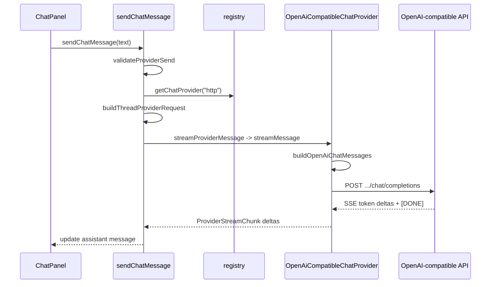

# Chat providers — HTTP connection integration (beta)

> **Beta feature.** The HTTP chat context (internal id `chat-http`) is an experimental
> beta lane (phase-3.5 M13). It is **disabled by default**. To enable it,
> turn on **Settings → Dev → Enable Chat (beta)**, then configure
> **Settings → Dev → Providers** or **Settings → Dev → Debug Provider**.

SpecOps routes **Chat context** (internal id `chat-http`) AI through a small
**provider registry**. Production traffic uses an **OpenAI-compatible HTTP
connection** configured in **Settings → Dev → Providers** (after enabling Chat
(beta)). **Debug** is a settings-gated local simulator for development.

**Workspace contexts** (internal id pattern `ws-*`) use the **OpenCode** backend
exclusively — they do not route through the HTTP provider registry. See
[opencode-integration.md](../opencode-integration.md) for setup details and the
[changelog](../../specs/changelog.md) for implementation history.

## Provider abstraction



### `ChatProvider` interface

Defined in `app/src/lib/ai/providers/types.ts`:

| Method | Purpose |
| --- | --- |
| `checkCapabilities` | Preflight: configured?, supported mode?, advertised capabilities |
| `sendMessage` | Non-streaming completion; returns full assistant text |
| `streamMessage` (optional) | Async iterable of text deltas |

Registry: `registerChatProvider` / `getChatProvider` in `registry.ts`. Bootstrap: `initializeChatProviders()` registers Debug and HTTP and wires `chatStore` capability checker + default provider resolver.

### Shared prompt payload

All providers receive the same **`ProviderRequestPayload`**:

- Mode (`ask` | `review`) and resolved **system prompt** (`modes/builtins.ts`)
- Workspace name and root path
- Optional **summary** from thread compaction (`chatRetention.ts`)
- **History** — user/assistant turns only (system UI events excluded)

Built by `buildThreadProviderRequest` → `buildProviderRequestFromThread` in `modes/prompt.ts`.

HTTP maps this to OpenAI-style messages in `openAiChatMessages.ts` (single combined `system` message + history).

## HTTP connection configuration

### Settings (`settings.json`)

Provider-specific blocks live under **`providerSettings`**
(`AppProviderSettings` in `contracts.ts`) and are normalized in
`appProviderSettings.ts`. HTTP configuration uses named connections, each with
its own model catalog:

```json
{
  "providerSettings": {
    "httpConnections": [
      {
        "id": "default",
        "label": "HTTP",
        "enabled": false,
        "baseUrl": "http://localhost:11434/v1",
        "modelCatalog": {
          "modelIds": ["gpt-4o-mini"],
          "defaultModelId": "gpt-4o-mini"
        }
      }
    ],
    "defaultConnectionId": "default",
    "debugChat": { "enabled": true, "simulationSeed": null, "delayMsMin": 200 },
    "debugWorkspace": { "enabled": true, "simulationSeed": null, "delayMsMin": 200 }
  }
}
```

The legacy singleton `providerSettings.http` is accepted only during load-time
normalization. Current settings and UI use `httpConnections`.

#### HTTP connections (`providerSettings.httpConnections`)

Normalized in `httpConnectionSettings.ts`:

| Field | Default | Purpose |
| --- | --- | --- |
| `id` | `default` | Internal connection id; also keys its API secret |
| `label` | `HTTP` | User-visible connection name |
| `enabled` | `false` | Connection toggle |
| `baseUrl` | `http://localhost:11434/v1` | API root |
| `modelCatalog` | `gpt-4o-mini` | Settings-managed model list and default |

#### Debug (`providerSettings.debugChat` / `debugWorkspace`)

Normalized in `debugProviderSettings.ts` (simulation timing, failure injection,
diagnostics). The two scoped simulators are enabled by default, but the Chat
simulator remains unreachable until **Enable Chat (beta)** is on.

Use `resolveHttpConnection` / `listConfiguredHttpConnections` for connection
selection and `getProviderSettings` for scoped debug settings. Extend
`ProviderSettingsById` when adding a configured provider type.

### Secrets (`provider-secrets.json`)

API keys per HTTP connection — `providerSecretsStore.ts`:

- Path: `{appDataDir}/spec-ops/provider-secrets.json`
- Format: `{ "version": 1, "keys": { "default": "..." } }` (keys are connection ids)
- Loaded at startup with `loadConnectionApiKeys()` and stored in app state by connection id
- **Never** written to `settings.json` or chat thread files
- A legacy `http` key is normalized to the default connection id on read.

### “Configured” definition

`isHttpConnectionConfigured(connection, apiKey)` requires an enabled connection,
a valid HTTP(S) base URL, and a non-empty API key. Unconfigured HTTP blocks send
and shows an inline setup CTA to **Settings → Dev → Providers**.

### Default provider selection

`resolveDefaultChatProvider` (`selection.ts`):

1. **HTTP** if configured (settings + key)
2. Else **debug-chat** if Debug Provider is enabled under **Settings → Dev**
3. Else **http** as product fallback (still blocked until key is set)

Product-selectable providers in the Chat UI are **`http`** connections plus
**`debug-chat`** when the simulator is available.

## HTTP adapter (`OpenAiCompatibleChatProvider`)

Implementation: `app/src/lib/ai/providers/openAiCompatibleChatProvider.ts`.

### Endpoint used

**OpenAI-compatible Chat Completions** on the configured base URL:

```
POST {baseUrl}/chat/completions
```

Resolver: `resolveOpenAiChatCompletionsUrl(baseUrl)` -> `{trimmedBase}/chat/completions`.

### Requests

| Aspect | Value |
| --- | --- |
| Method | `POST` |
| Auth | `Authorization: Bearer {apiKey}` |
| Content-Type | `application/json` |

Both methods call the same endpoint with the same messages. The `stream` field
selects the response mode:

```json
{
  "model": "<resolved model id from thread/catalog>",
  "messages": [
    { "role": "system", "content": "<mode prompt + workspace + optional summary>" },
    { "role": "user|assistant", "content": "..." }
  ],
  "stream": "<false for sendMessage; true for streamMessage>"
}
```

`model` comes from `ProviderSendRequest.modelId` (thread `selectedModelId` or provider default).

### Response handling

`sendMessage` uses `stream: false`. On HTTP 2xx it parses JSON and reads:

- `choices[0].message.content` — required non-empty trimmed string
- Top-level `error.message` — treated as failure even on 200

`streamMessage` uses `stream: true`. On HTTP 2xx it parses OpenAI-compatible
SSE `data:` records, emits `choices[0].delta.content` text incrementally, and
finishes on `[DONE]`.

Errors: map status **401**, **403**, **429**, **5xx**, and model rejection messages via `mapHttpError` / `modelValidation.ts`. Bearer tokens in API messages are redacted in user copy.

### Capabilities

`checkCapabilities` when configured:

- `supportedModes`: `ask`, `review`
- `canReadWorkspaceFiles`: `true` (capability flag; actual file reads are not attached to prompts in MVP)

Unsupported modes return `WorkspaceAccessReason.ProviderUnsupported`.

## Streaming behavior

| Provider | `streamMessage` | UI behavior |
| --- | --- | --- |
| **Debug** | Implemented | Token-style partial updates in chat |
| **HTTP** | Implemented | OpenAI-compatible SSE parsing with incremental chat updates |

HTTP supports both paths:

- `streamMessage` sends `stream: true` and parses OpenAI-compatible SSE (`data: {...}` and `[DONE]`).
- `sendMessage` remains as buffered fallback (`stream: false`) for non-stream call sites/tests.

## OpenAI-compatible API: used vs unused

The app targets an OpenAI-compatible chat-completions surface. Only **one operation** is implemented.

### Used

| API | Path (relative to `baseUrl`) | Notes |
| --- | --- | --- |
| Chat Completions | `/chat/completions` | Buffered JSON (`stream: false`) and streaming SSE (`stream: true`); text `messages` + `model` only |

### Not used (no code paths)

These are common on OpenAI-compatible platforms but **absent from the codebase**:

| Category | Examples | Notes |
| --- | --- | --- |
| Other chat params | `temperature`, `top_p`, `max_tokens`, `stop`, `presence_penalty`, `frequency_penalty`, `tools`, `tool_choice`, `response_format` | Not sent |
| Multimodal / files | Image, file, or audio content in messages | Text-only `content` strings |
| Embeddings | `/embeddings` | — |
| Legacy/completion APIs | `/completions` (non-chat) | — |
| Model management | `GET /models`, dynamic model discovery | Catalog is settings-managed |
| Batch / async jobs | Batch inference endpoints | — |
| Tool / function calling | `tools`, function messages | — |
| Reasoning / thinking blocks | Vendor-specific extended fields | — |

`baseUrl` is user-configurable in Settings (for hosted APIs, gateways, or proxies). The app always appends `/chat/completions` — the base must be an API root that exposes that path.

## Other provider IDs

| Id | Status |
| --- | --- |
| `http` | Implemented (`openAiCompatibleChatProvider.ts`); **Chat context only** |
| `debug-chat` | Implemented (`debugChatProvider.ts`); Chat beta simulator |
| `debug-workspace` | Implemented (`debugChatProvider.ts`); workspace-session simulator |

## Error and validation flow

1. **Local** — `validateLocalModelSelection` ensures `modelId` is in the provider catalog before HTTP.
2. **Preflight** — `chatStore.runAccessPreflight` + `createRegistryCapabilityChecker`.
3. **Runtime** — HTTP errors and model rejection strings → `ChatProviderError` with user-safe `userMessage`.

Send blocked reasons include `http_not_configured`, `invalid_model`, `preflight`, `provider_error` (`sendChatMessage.ts`).

## Key source files

| File | Responsibility |
| --- | --- |
| `openAiCompatibleChatProvider.ts` | HTTP adapter, error mapping |
| `openAiChatMessages.ts` | Payload -> `messages[]` |
| `appProviderSettings.ts` | Bundle normalize, `getProviderSettings` helpers |
| `httpConnectionSettings.ts` | HTTP defaults, normalize, configured checks |
| `debugProviderSettings.ts` | Debug simulator defaults and normalize |
| `providerSecretsStore.ts` | Provider API key persistence |
| `bootstrap.ts` | Register providers at startup |
| `capabilityChecker.ts` | Registry-backed preflight |
| `selection.ts` | Default provider, switch fallbacks |
| `providerModelCatalog.ts` | Model lists per provider |
| `sendChatMessage.ts` | End-to-end turn lifecycle |
| `chatSend.ts` | Stream vs buffered dispatch |
| `ConnectionsSettingsPanel.svelte` | HTTP provider base URL and API key UI; internal tab id `connections`, visible label **Providers** |
| `ChatPanel.svelte` | Composer, blocked states, model selector |

## Extending HTTP integration

When adding features, keep the adapter thin:

1. Extend **`ProviderRequestPayload`** or mode prompts if context changes — not provider-specific fields in the send path.
2. Add request fields in **`openAiCompatibleChatProvider.ts`** with tests in provider adapter tests.
3. When changing streaming, keep **`streamMessage`** SSE parsing and the
   buffered `sendMessage` fallback aligned; update `streamProviderMessage`
   consumers and UX copy together.
4. Never persist API keys outside **`providerSecretsStore`**.

See [architecture.md](../architecture.md) for overall layering and agent conventions.
Implementation history is recorded in the
[changelog](../../specs/changelog.md).
