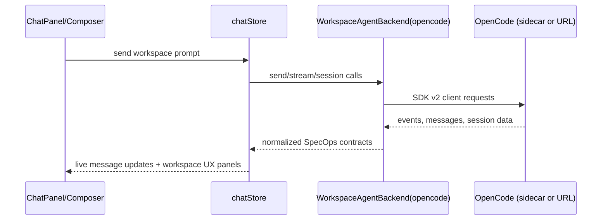

# OpenCode integration

> **Beta feature.** The workspace-sessions backend (OpenCode) is experimental
> and **disabled by default**. Enable it under **Settings → Dev → Enable
> OpenCode (beta)**. See [`docs/beta/opencode-workspace-sessions.md`](./beta/opencode-workspace-sessions.md)
> for the opt-in flow and what is hidden when it is off.

SpecOps uses OpenCode as the backend for all workspace-session workflows
(`ws-*` is the internal context-id pattern). Chat HTTP providers are only used
in the internal `chat-http` context.

## Integration at a glance

- Workspace chat send/stream/lifecycle operations go through `WorkspaceAgentBackend` (`opencode` backend id).
- The app can talk to OpenCode in two modes:
  - `sidecar` (default): local process managed by SpecOps
  - `url`: remote OpenCode server URL
- OpenCode health is tracked in app settings (`settings.opencodeHealth`) and surfaced in Settings + title-bar status UI.



## User-facing terminology

SpecOps uses the following vocabulary in the UI:

| Term | Meaning |
| --- | --- |
| **Session** | A workspace conversation — sidebar row, tab, transcript, and lifecycle actions (fork, share, rename, …). |
| **Agent** | An OpenCode **persona/config** only — Settings → Workspaces → Agents, composer persona picker, `@agent:` mentions, default agent in config. |
| **Chat** | The experimental `chat-http` lane (enabled at Settings → Dev → Enable Chat (beta)); unrelated to workspace sessions. |

Internal code uses **session** for conversations: `sessionId`,
`SessionIndexEntry`, `SessionsSidebar`, and `chat/{hash}/` (`sessions`
envelope). The OpenCode SDK bridges in `workspaceAgentBackend.ts` keep the
**agent** module name for the SDK wrapper. Do not confuse with:

- **OpenCode session** — server-side conversation object linked via `opencodeSessionId`.
- **Window session** — `SessionState` in `session.json` (editor tabs, last active context); not a chat session.

## Core concepts: workspaces, sessions, agents

### Workspace

- A workspace is a folder-backed context (`ws-*`).
- OpenCode data is scoped to workspace root path.
- Session lists, model catalogs, TODOs, diffs, and status summaries are loaded per workspace.

### Workspace session (UI)

- A **session** is SpecOps UI state in `chatStore` + tab state in `appState` — what users see in the sidebar and tab bar.
- Each session entry may be linked to an OpenCode session via `opencodeSessionId`.
- Draft sessions can exist before a linked OpenCode session exists.

### OpenCode session (server)

- The server-side conversation object in OpenCode.
- A session can be:
  - linked to an existing workspace session tab
  - opened from external OpenCode history into a new SpecOps session tab
- Session lifecycle actions (fork/revert/share/summarize/export/rename) are performed against this server-side session.

### Agent (persona)

- OpenCode agent definitions (`build`, `plan`, custom agents) configured under Settings → Workspaces → Agents.
- Selected in the composer persona picker; referenced in prompts via `@agent:`.

## Relationship model

- **One workspace → many workspace sessions**
- **One workspace session tab → zero or one linked OpenCode session**
- **One OpenCode workspace → many OpenCode sessions**
- SpecOps can open sessions that were not originally created in SpecOps (**All sessions…** / session list).

## Key integrated features

- **Richer transcript rendering:** reasoning, subtasks, step boundaries, attachments, diffs, totals.
- **Session lifecycle:** rename, fork, undo/redo (`revert`/`unrevert`), share/unshare, summarize, export, session list.
- **Composer UX:** slash commands, mentions, file attachments, prompt queueing.
- **Workspace UX panels:** TODO, changes/diff viewer, file status badges, status popover.
- **Configuration management:** OpenCode config, providers, MCP servers, agents, permissions, commands, instructions.

## First session (quick path)

1. **Install OpenCode** (development builds expect `opencode` on `PATH`; release builds bundle a sidecar):
   ```sh
   curl -fsSL https://opencode.ai/install | bash
   ```
2. Open a **workspace folder** in SpecOps (activity rail → add folder).
3. SpecOps starts the sidecar **lazily** — on the first **Send** in a session tab, or via **Settings → Workspaces → OpenCode → Check connection**. Editing files does not require OpenCode.
4. **Connect a provider** in OpenCode (see [Provider setup](#provider-setup-openrouter-glm-coding-plan-) below). Workspace sessions do not use SpecOps **Dev → Providers** HTTP keys.
5. In SpecOps: **Refresh model list** (Settings → Workspaces → OpenCode), then pick agent, provider, and model in the session composer.
6. Use the **Sessions** sidebar: create a session tab and send a prompt.

## Setup OpenCode in SpecOps

1. Open **Settings → Workspaces → OpenCode**.
2. Ensure **Use OpenCode for workspace sessions** is enabled.
3. Choose transport mode:
   - **Sidecar (default):** local OpenCode sidecar managed by SpecOps.
     The **Sidecar port** field sets the local port the sidecar binds to
     (default `4096`; validated to 1024–65535). The effective sidecar URL
     is shown read-only below the input — it tracks the port so the URL
     probe and SDK wiring stay consistent. Change the port only when
     `4096` is already in use locally.
   - **URL:** run OpenCode yourself, then enter the server base URL:
     ```sh
     cd /path/to/your/project
     opencode serve
     ```
     Example URL: `http://127.0.0.1:4096`.
4. If your server requires auth, set **Server password** (stored in `provider-secrets.json`, not in `settings.json`). Use the same value as `OPENCODE_SERVER_PASSWORD` on the server when set.
5. Click **Check connection** to verify health.
6. Click **Refresh model list** to load current server models.
7. Open a workspace and start or select a session.

## Provider setup (OpenRouter, GLM Coding Plan, …)

API keys and model catalogs for **workspace sessions** live in **OpenCode**, not
in SpecOps `settings.json`. After you connect a provider, use **Refresh model
list** in SpecOps so the composer picks up models from the running server.

Configure providers once with the OpenCode CLI (auth is shared with the sidecar SpecOps starts):

```sh
cd /path/to/your/project
opencode
```

### OpenRouter

1. Create an API key at [openrouter.ai/keys](https://openrouter.ai/keys).
2. In the OpenCode TUI, run `/connect`, choose **OpenRouter**, and paste the key.
3. Run `/models` and select a model (many OpenRouter models are preloaded).

Alternatively, set the key in `~/.local/share/opencode/auth.json`:

```json
{
  "openrouter": {
    "type": "api",
    "key": "sk-or-your-key-here"
  }
}
```

Optional: pin or add models in `opencode.json` (project root or OpenCode config path):

```json
{
  "$schema": "https://opencode.ai/config.json",
  "provider": {
    "openrouter": {
      "models": {
        "anthropic/claude-sonnet-4": {},
        "google/gemini-2.5-flash": {}
      }
    }
  }
}
```

See [OpenRouter + OpenCode](https://openrouter.ai/docs/cookbook/coding-agents/opencode-integration) and [OpenCode providers](https://opencode.ai/docs/providers/) for model IDs and routing options.

### GLM Coding Plan (Z.AI)

1. Get an API key from the [Z.AI API Console](https://docs.z.ai/scenario-example/develop-tools/opencode) (see Z.AI docs for your plan).
2. Authenticate OpenCode — use either `/connect` in the TUI or:
   ```sh
   opencode auth login
   ```
   Search for **Z.AI** and choose **Z.AI Coding Plan** (not the generic **Z.AI** provider; they use different endpoints and model IDs).
3. Enter your API key, then run `/models` and pick a model such as **GLM-4.7**.

Details: [Z.AI + OpenCode](https://docs.z.ai/scenario-example/develop-tools/opencode), [OpenCode providers — Z.AI](https://opencode.ai/docs/providers/#zai).

## Troubleshooting

- **Health not “Healthy”** — Confirm `opencode` is installed (`which opencode`) or use URL mode against a running `opencode serve`.
- **Empty model list** — Connect a provider in OpenCode first, then **Refresh model list** in SpecOps settings.
- **Auth errors** — Re-run `/connect` or fix `auth.json`; workspace sends never read HTTP keys from SpecOps **Dev → Providers**.
- **Legacy workspace chat** — Threads from the pre–phase-3 HTTP workspace provider are not migrated into OpenCode sessions.
- **Chat (beta) / HTTP chat context** — Experimental. Disabled by default; see [beta/chat-http-providers.md](./beta/chat-http-providers.md). Turn on **Settings → Dev → Enable Chat (beta)**.

## Sidecar notes

- Bundled binaries are expected at `app/src-tauri/binaries/opencode-<target-triple>`.
- In development, if a bundled binary is missing, SpecOps falls back to an `opencode` executable on `PATH`.
- The maintainer script
  [`scripts/update-opencode-sidecar.sh`](../scripts/update-opencode-sidecar.sh)
  refreshes the bundled binaries from upstream GitHub releases. See
  [`app/src-tauri/binaries/README.md`](../app/src-tauri/binaries/README.md)
  for asset→triple mapping and usage (npm alias: `npm --prefix app run update-opencode-sidecar`).
- The bundled CLI version can drift from the `@opencode-ai/sdk` version in
  `app/package.json` (SDK uses a caret range and resolves at install time;
  bundled binary is a pinned release). The script does not modify the
  SDK lockfile — bump `@opencode-ai/sdk` manually if you need them to
  match exactly.

## Sidecar lifecycle — lazy, session-scoped

The sidecar is **lazy** and **session-scoped**. It does not start when a workspace opens or when a file/editor tab is active.

| Trigger | Sidecar spawns? |
| --- | --- |
| Send on a session tab (sidecar mode) | **Yes** (primary) |
| Settings → **Check connection** | **Yes** (explicit retry; clears circuit breaker) |
| Settings → **Refresh model list** | **Yes** |
| Open OpenCode config sub-panels (providers, MCP, agents, …) | **Yes** (explicit) |
| Workspace add / switch / lifecycle | **No** |
| File/editor tab active | **No** |
| Session tab open (idle) | **No** |
| Catalog auto-prefetch on session-tab mount | **No** (deferred until Send or Settings refresh) |

### Non-session tabs never touch OpenCode

On `file`/`editor`/`notepad` tabs the app shell skips OpenCode entirely — no sidecar attach, no catalog refresh, no file-status fetch, no reconcile / hydrate. Workspace file editing does not require OpenCode.

### Background reconcile + hydrate (session tab only)

When the user opens / switches a workspace **on a session tab**, a fire-and-forget background reconcile + hydrate runs **only when all** of:

1. Sidecar is already running and healthy (status probe only — no attach).
2. Active session has a linked OpenCode session id.
3. Thread has ≥ 1 message.
4. Last message role is `user` (pending turn; skip when `assistant` — local cache is sufficient after a completed turn).

Always show the local transcript immediately on switch; the background work is best-effort, single-flight, non-blocking.

### Circuit breaker on hard failure

Treat `portInUse`, `missingBinary`, `launchFailure`, and `healthTimeout` as hard failures. On hard failure:

1. `opencodeHealth.status = "error"` with an actionable `lastErrorMessage`.
2. In-memory circuit-breaker flag (cleared by app restart, an explicit Settings action, or a successful explicit start).
3. **One deduped snackbar** per failure episode: *"OpenCode could not start. Check Settings → Workspaces → OpenCode."*
4. No automatic retry on workspace switch, session-tab switch, or effect re-runs.

Clear breaker: user clicks **Check connection**, toggles OpenCode enabled / mode, or sends the first message after the failure (Send may attempt once and surface the error).

### Non-blocking spawn

`opencode_sidecar_attach_workspace` no longer blocks the Tauri IPC thread for up to 10 s. It spawns the process and returns with `health: checking`; a dedicated background thread polls `/global/health` and updates the sidecar state. The frontend `ensureOpencodeSidecar({ intent: "send" })` waits on the resolved health (with a 10 s cap) so the Send button stays responsive.

## Important source files

- Backend + SDK mapping: `app/src/lib/ai/backends/workspaceAgentBackend.ts`
- Sidecar runtime/health: `app/src/lib/services/opencodeSidecar.ts`
- OpenCode settings defaults/validation: `app/src/lib/services/opencodeSettings.ts`
- Session lifecycle handlers: `app/src/lib/services/appShellAgentHandlers.ts`
- Hydration from `session.messages`: `app/src/lib/services/workspaceAgentHydration.ts`
- OpenCode Settings UI: `app/src/lib/components/settings/OpenCodeSettingsPanel.svelte`
