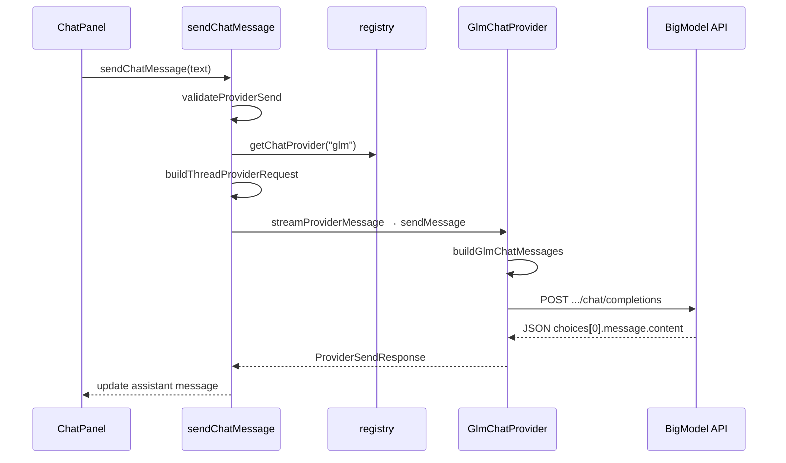

# Chat providers — GLM integration

SpecOps routes workspace AI chat through a small **provider registry**. Production traffic uses **GLM** (Zhipu BigModel Open Platform). **Debug** is a settings-gated local simulator for development.

## Provider abstraction



### `ChatProvider` interface

Defined in `app/src/lib/ai/providers/types.ts`:

| Method | Purpose |
| --- | --- |
| `checkCapabilities` | Preflight: configured?, supported mode?, advertised capabilities |
| `sendMessage` | Non-streaming completion; returns full assistant text |
| `streamMessage` (optional) | Async iterable of text deltas |

Registry: `registerChatProvider` / `getChatProvider` in `registry.ts`. Bootstrap: `initializeChatProviders()` registers Debug and GLM and wires `chatStore` capability checker + default provider resolver.

### Shared prompt payload

All providers receive the same **`ProviderRequestPayload`**:

- Mode (`ask` | `review`) and resolved **system prompt** (`modes/builtins.ts`)
- Workspace name and root path
- Optional **summary** from thread compaction (`chatRetention.ts`)
- **History** — user/assistant turns only (system UI events excluded)

Built by `buildThreadProviderRequest` → `buildProviderRequestFromThread` in `modes/prompt.ts`.

GLM maps this to OpenAI-style messages in `glmPrompt.ts` (single combined `system` message + history).

## GLM configuration

### Settings (`settings.json`)

`GlmProviderSettings` in `contracts.ts`, normalized in `glmProviderSettings.ts`:

| Field | Default | Purpose |
| --- | --- | --- |
| `enabled` | `true` | Provider toggle |
| `baseUrl` | `https://open.bigmodel.cn/api/paas/v4` | API root (trailing slashes stripped) |
| `modelId` | `glm-4-flash` | Legacy default; kept in sync with GLM catalog default |

Model lists and per-thread selection use **`providerModelCatalogs.glm`** (`providerModelCatalog.ts`), editable in Settings. Defaults: `glm-4-flash`, `glm-4-air`, `glm-4-plus`.

### Secrets (`provider-secrets.json`)

API keys per provider — `providerSecretsStore.ts`:

- Path: `{appDataDir}/spec-ops/provider-secrets.json`
- Format: `{ "version": 1, "keys": { "glm": "..." } }` (`Partial<Record<ChatProviderId, string>>`)
- Loaded at startup in `appShellRuntime.ts` → `appState.setProviderApiKey("glm", …)`
- **Never** written to `settings.json` or chat thread files
- **Breaking change (R3-1):** `glm-secrets.json` is no longer read; re-enter GLM API key after upgrade

### “Configured” definition

`isGlmProviderConfigured(settings, apiKey)` — `enabled` and non-empty trimmed API key. Unconfigured GLM blocks send and shows inline setup CTA in `ChatPanel.svelte` (Settings → GLM).

### Default provider selection

`resolveDefaultChatProvider` (`selection.ts`):

1. **GLM** if configured (settings + key)
2. Else **debug** if debug provider enabled in Developer Settings
3. Else **glm** as product fallback (still blocked until key is set)

Product-selectable providers in UI: **`glm`** only; debug appears when enabled.

## GLM adapter (`GlmChatProvider`)

Implementation: `app/src/lib/ai/providers/glmChatProvider.ts`.

### Endpoint used

**OpenAI-compatible Chat Completions** on the configured base URL:

```
POST {baseUrl}/chat/completions
```

Resolver: `resolveGlmChatCompletionsUrl(baseUrl)` → `{trimmedBase}/chat/completions`.

Default full URL:

`https://open.bigmodel.cn/api/paas/v4/chat/completions`

This is the [Zhipu BigModel](https://open.bigmodel.cn/) **PAAS v4** HTTP API (same family as OpenAI’s chat completions schema).

### Request

| Aspect | Value |
| --- | --- |
| Method | `POST` |
| Auth | `Authorization: Bearer {apiKey}` |
| Content-Type | `application/json` |

JSON body (only these fields are sent):

```json
{
  "model": "<resolved model id from thread/catalog>",
  "messages": [
    { "role": "system", "content": "<mode prompt + workspace + optional summary>" },
    { "role": "user|assistant", "content": "..." }
  ],
  "stream": false
}
```

`model` comes from `ProviderSendRequest.modelId` (thread `selectedModelId` or provider default), not from the legacy `glmProvider.modelId` field at send time.

### Response handling

Success (HTTP 2xx): parse JSON, read:

- `choices[0].message.content` — required non-empty trimmed string
- Top-level `error.message` — treated as failure even on 200

Errors: map status **401**, **403**, **429**, **5xx**, and model rejection messages via `mapGlmHttpError` / `modelValidation.ts`. Bearer tokens in API messages are redacted in user copy.

### Capabilities

`checkCapabilities` when configured:

- `supportedModes`: `ask`, `review`
- `canReadWorkspaceFiles`: `true` (capability flag; actual file reads are not attached to prompts in MVP)

Unsupported modes return `WorkspaceAccessReason.ProviderUnsupported`.

## Streaming behavior

| Provider | `streamMessage` | UI behavior |
| --- | --- | --- |
| **Debug** | Implemented | Token-style partial updates in chat |
| **GLM** | Not implemented | `streamProviderMessage` falls back to `sendMessage`; UI receives one chunk (full text) |

GLM explicitly sets **`stream: false`**. There is no SSE client, no `stream: true` path, and no `GlmChatProvider.streamMessage`.

README describes this as “streaming on Debug with buffered GLM fallback.”

## BigModel / GLM API: used vs unused

The app targets the **v4 PAAS OpenAI-compatible** surface. Only **one operation** is implemented.

### Used

| API | Path (relative to `baseUrl`) | Notes |
| --- | --- | --- |
| Chat Completions | `/chat/completions` | Non-streaming; `messages` + `model` only |

### Not used (no code paths)

These are common on the BigModel / OpenAI-compatible platform but **absent from the codebase**:

| Category | Examples | Notes |
| --- | --- | --- |
| Streaming | `stream: true`, SSE chunks | Explicitly disabled |
| Other chat params | `temperature`, `top_p`, `max_tokens`, `stop`, `presence_penalty`, `frequency_penalty`, `tools`, `tool_choice`, `response_format` | Not sent |
| Multimodal / files | Image, file, or audio content in messages | Text-only `content` strings |
| Embeddings | `/embeddings` | — |
| Legacy/completion APIs | `/completions` (non-chat) | — |
| Model management | `GET /models`, dynamic model discovery | Catalog is settings-managed |
| Batch / async jobs | Batch inference endpoints | — |
| Tool / function calling | `tools`, function messages | — |
| Reasoning / thinking blocks | Vendor-specific extended fields | — |

If Zhipu adds endpoints under the same `baseUrl`, they are unused unless a new adapter method is added.

### Alternate base URLs

`baseUrl` is user-configurable in Settings (for proxies or regional endpoints). The app always appends `/chat/completions` — the base must be the API **root** that exposes that path (default PAAS v4 root above).

## Other provider IDs

| Id | Status |
| --- | --- |
| `glm` | Implemented (`glmChatProvider.ts`) |
| `debug` | Implemented (`debugChatProvider.ts`); dev-only |
| `cursor` | Type + catalog placeholder (`auto` model); **not registered**; planned optional provider |

## Error and validation flow

1. **Local** — `validateLocalModelSelection` ensures `modelId` is in the provider catalog before HTTP.
2. **Preflight** — `chatStore.runAccessPreflight` + `createRegistryCapabilityChecker`.
3. **Runtime** — HTTP errors and model rejection strings → `ChatProviderError` with user-safe `userMessage`.

Send blocked reasons include `glm_not_configured`, `invalid_model`, `preflight`, `provider_error` (`sendChatMessage.ts`).

## Key source files

| File | Responsibility |
| --- | --- |
| `glmChatProvider.ts` | HTTP adapter, error mapping |
| `glmPrompt.ts` | Payload → `messages[]` |
| `glmProviderSettings.ts` | Defaults, normalize, configured checks |
| `providerSecretsStore.ts` | Provider API key persistence |
| `bootstrap.ts` | Register providers at startup |
| `capabilityChecker.ts` | Registry-backed preflight |
| `selection.ts` | Default provider, switch fallbacks |
| `providerModelCatalog.ts` | Model lists per provider |
| `sendChatMessage.ts` | End-to-end turn lifecycle |
| `chatSend.ts` | Stream vs buffered dispatch |
| `SettingsDialog.svelte` | GLM base URL, key, catalogs |
| `ChatPanel.svelte` | Composer, blocked states, model selector |

## Extending GLM integration

When adding features, keep the adapter thin:

1. Extend **`ProviderRequestPayload`** or mode prompts if context changes — not GLM-only fields in the send path.
2. Add request fields in **`glmChatProvider.ts`** only with tests in `glmChatProvider.test.ts`.
3. For streaming, implement **`streamMessage`** with SSE parsing and keep `sendMessage` as fallback; update `streamProviderMessage` consumers and UX copy.
4. Never persist API keys outside **`providerSecretsStore`**.

See [architecture.md](./architecture.md) for overall layering and agent conventions.
