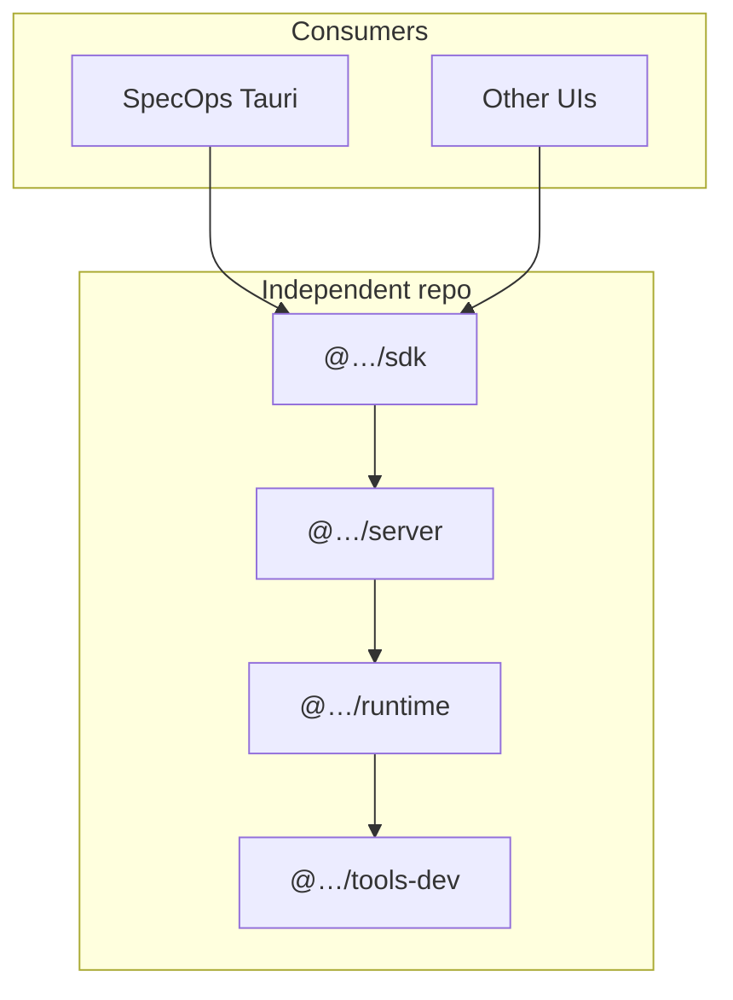

# Phase 6 — Own agent platform (OpenCode alternative)

**Parent:** [roadmap.md](../roadmap.md)  
**Prerequisite:** [phase-5.md](../phase-5/phase-5.md) shipped (workspace agents stable on OpenCode + optional Cursor local)  
**Status:** optional / planning  
**Estimate:** ~3+ months for full platform parity (separate repo); SpecOps integration incremental  
**Historical depth:** evolved from former `migration-plan.md` (2026-06-04)

## Goal

Build a **domain-agnostic agent platform** (independent npm repo) and wire it into SpecOps as a **third workspace backend** — an alternative to depending on **OpenCode** for the agent harness (sessions, tools, permissions, plan/build).

| Phase | Workspace agent runtime |
|-------|-------------------------|
| [phase-3.md](../phase-3/phase-3.md) | **OpenCode** (`@opencode-ai/sdk` + server) — primary shipping path |
| [phase-5.md](../phase-5/phase-5.md) | **Cursor local** — switchable per workspace |
| **Phase 6** | **`specops-platform`** (working id) — own server + SDK behind `WorkspaceAgentBackend` |

Chat (`chat-http`) and Cloud (`chat-cloud`) stay on HTTP and Cursor SDK; phase 6 does **not** replace those lanes.

## Why optional, why after phase 5 (G2A)

- **Ship product first:** [phase-3.md](../phase-3/phase-3.md) delivers “SpecOps as OpenCode UI” without waiting for a new platform repo.
- **Prove UX:** Agent sidebar, events, permissions, and backend switching are validated before a large extraction.
- **Reduce risk:** OpenCode remains the default workspace backend (F3A) until the native platform reaches parity and you choose to offer it as a setting.

Pursue phase 6 when OpenCode coupling blocks you (licensing, API drift, customization) or you need a publishable platform for other apps — not as a prerequisite for MVP.

## Product integration (SpecOps)

### `WorkspaceAgentBackend` extension

From [phase-1.md](../phase-1/phase-1.md):

```ts
export type WorkspaceAgentBackendId =
  | "opencode"
  | "cursor-local"
  | "specops-platform"; // phase 6
```

SpecOps workspace settings (extends phase 5):

- `agentBackend: "opencode" | "cursor-local" | "specops-platform"`
- Same capability matrix pattern (F2A): badge / disable unsupported features per backend.

### Deployment (align E1C pattern)

- **Default:** Tauri sidecar runs **own** agent server on localhost (like OpenCode sidecar).
- **Optional:** User-provided server URL in settings.
- **Directory binding:** workspace `rootPath` → server instance (same mental model as OpenCode `directory`).

### What SpecOps reuses from phase 3

UI and event normalization built for OpenCode (tool cards, permissions, questions) should target **`AgentEvent`** (or shared interface), not OpenCode types directly — so phase 6 swaps the adapter, not the whole workspace UI.

## Vision — independent platform

Publishable TypeScript stack (concepts from a mature coding-agent reference; **no product coupling** in package names or user strings):

| Capability | Notes |
|------------|--------|
| Agent workflow | LLM turns, tools, sub-agents, permissions, human-in-the-loop |
| Plan / build | Separate agents, plan files, `plan_enter` / `plan_exit` |
| Providers / models | Shared catalog package |
| TypeScript SDK | `async`/`await` + `AsyncIterable`; Effect internal only (8B) |

### Packages (working names)

| Package | Role |
|---------|------|
| `@…/runtime` | Sessions, agents-as-config, providers, permissions, pluggable storage |
| `@…/tools-dev` | Filesystem, shell, MCP, built-in dev agents, plan mode |
| `@…/sdk` | HTTP client + streaming helpers |
| `@…/providers` | Provider/model catalog (optional split) |
| `@…/server` | Long-lived host: HTTP/SSE, MCP, PTY, file watchers |

### Architecture



**Deployment model (decided):** remote HTTP server (localhost or self-hosted); not in-process in Tauri v1 (3A).

## Platform decisions (from planning questionnaire)

| # | Topic | Decision |
|---|--------|----------|
| 1 | Primary goal | Domain-agnostic framework; dev tools in adapter pack |
| 2 | Location | Standalone npm repository |
| 3 | Deployment | HTTP/SSE server |
| 4 | Domain v1 | Full `tools-dev` dev parity |
| 5 | Plan/build | Exact reference semantics |
| 6 | Agents | Built-ins + config-only extensions |
| 7 | Provider catalog | Shared catalog package |
| 8 | SDK style | Plain async + AsyncIterable |
| 9 | Reference UI | SpecOps + IDE session layout |
| 10 | Consumers | External npm consumers, not only SpecOps |
| 11 | Storage | Pluggable; SQLite default |
| 12 | Permissions | Full ask/allow/deny + prompts |
| 13 | Events | Normalized `AgentEvent` + raw SSE (recommended D) |
| 15 | Timeline | Full parity ~3+ months |

Open items: repo name / npm scope, event API default stream, license/porting strategy — track in platform repo when started.

## Reference UI mapping (SpecOps workspace)

Maps existing SpecOps shell to SDK (same targets as phase 3 OpenCode UI):

| UI area | Platform SDK |
|---------|----------------|
| Session composer | `sessions.prompt()` / `sessions.run()` → text-delta, tools |
| Agent sidebar | `agents.list()`, session per agent tab |
| Plan / Build | `plan` / `build` agents or plan tools |
| Model picker | `providers.list()`, `models.list()` |
| Settings → Providers | `config.patch` |
| Settings → Agents | Config schema only |
| Permission modal | `permissions.reply()` |
| Question dialog | `questions.reply()` |
| Sub-agent tasks | `task` tool + nested session |
| Terminal (stretch) | PTY WebSocket |

SpecOps layout: agents sidebar, agent tabs, editor, console — see [phase-3.md](../phase-3/phase-3.md).

## Platform milestones (new repo)

Work primarily in **independent repository**; SpecOps integrates published packages.

| Milestone | Platform | SpecOps integration |
|-----------|----------|---------------------|
| **M0** Foundation | Repo, CI, `AgentEvent` v1, OpenAPI v1, storage interface | Align types with phase 3 event mapper |
| **M1** Runtime | `@…/runtime`, `@…/server`, `@…/sdk` sessions + stream | `WorkspaceAgentBackend` stub → MVP client |
| **M2** tools-dev | Tools, plan/build, permissions E2E | Parity with phase 3 E3B feature set |
| **M3** Advanced | MCP, LSP, PTY, worktrees, raw SSE | Plan/build in UI (phase 3 S6 stretch) |
| **M4** Publish | npm, docs, examples | Settings: offer `specops-platform` backend |

**Horizon:** ~3+ months full parity (15B).

### Alignment with phase 3 OpenCode checklist

| phase-3 / migration S | Phase 6 platform | Notes |
|-------------------------|------------------|--------|
| S1 Server + health | M1 | Own server binary |
| S2 Sessions + agents | M1 | Same SpecOps tab mapping |
| S3 Event stream | M1–M2 | Shared UI from phase 3 |
| S4 Providers / models | M2 | Own catalog package |
| S5 Permissions | M2 | Required for cutover |
| S6 Plan/build | M3 | Post-MVP |

SpecOps **does not** remove OpenCode when phase 6 starts — offer **backend choice** when native platform is ready.

## Independent repo policy

| Rule | Rationale |
|------|-----------|
| No reference product names in packages/docs | Independent identity |
| Concepts, not blind fork | License-reviewed port or clean-room |
| Neutral terms | `runtime`, `tools-dev`, `primary` / `subagent` |
| Own OpenAPI / schemas | SDK semver |

## Non-goals (phase 6)

- Replacing OpenCode in phase 3 scope (OpenCode ships first).
- Chat HTTP or Cursor cloud backends (see [phase-7.md](../phase-7/phase-7.md)).
- Mandatory for SpecOps MVP.

## Exit criteria (when SpecOps integrates)

- [ ] Published `@…/sdk` + server usable on localhost with `directory` = workspace root.
- [ ] SpecOps `specops-platform` backend passes same E3B bar as phase 3 (stream + tools + permissions).
- [ ] User can select backend per workspace alongside OpenCode and Cursor local.
- [ ] Documented differences vs OpenCode in settings copy.

## Task outline (high level)

| ID | Task |
|----|------|
| P6-0 | Decide repo name, license, event API lock (13D) |
| P6-1 | M0–M1 platform repo bootstrap |
| P6-2 | SpecOps adapter implementing `WorkspaceAgentBackend` |
| P6-3 | M2 tools-dev + permissions parity |
| P6-4 | Settings backend option + capability matrix |
| P6-5 | M3–M4 advanced + publish |

## Related docs

| Doc | Role |
|-----|------|
| [roadmap.md](../roadmap.md) | Phase index |
| [phase-3.md](../phase-3/phase-3.md) | OpenCode UI (shipping path) |
| [phase-7.md](../phase-7/phase-7.md) | WebUI tier 2/3 (chat context, separate optional) |
| [roadmap-questions.md](../roadmap-questions.md) | G2A historical |

## Changelog

| Date | Change |
|------|--------|
| 2026-06-04 | Renamed from migration-plan.md; reframed as optional phase 6 workspace backend |
| 2026-06-02 | Initial migration/platform plan |
