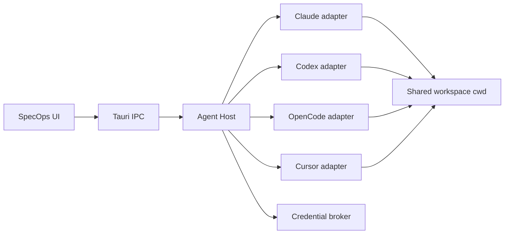

# SpecOps agent sessions roadmap

**Status:** planning (2026-08-11)  
**Source of truth:** this file plus the milestone scope and execution plans in
the numbered phase folders.  
**Supersedes:** the former Chat / Cloud / per-workspace-backend roadmap and its planned phases 4–7.

---

## Product direction

SpecOps is a desktop workspace with one unified **Sessions** surface for coding
agents. A user opens a workspace, creates independent sessions, and chooses the
runtime, model, mode, and permissions for each session.

Initial runtime order:

1. **Claude**
2. **Codex**
3. **OpenCode**
4. **Cursor**

ZCode is not in scope. The standalone HTTP **Chat** context and the planned
Cursor **Cloud** context are removed from the target product. Cursor cloud may
become a session execution target later, but never a separate activity-rail
context.

### Product promise

> One workspace, one session list, multiple coding-agent runtimes.

SpecOps owns the common control plane:

- session creation, navigation, status, archive, and cancellation;
- normalized transcript, tool, permission, question, cost, and usage UI;
- runtime and model selection at session creation;
- capability-aware actions and runtime-specific extension panels;
- handoff from one runtime to a new session on another runtime;
- shared workspace diff/review and visibility into concurrent activity.

SpecOps does not pretend that native sessions are portable. A session stays
bound to its runtime for its entire lifetime.

---

## Product model

| Surface | Scope | Notes |
|---------|-------|-------|
| **Notepad** | Global | No AI |
| **Workspace** | Folder | Editor, project tree, version control, Sessions |
| **Session** | Workspace | One fixed runtime, native session id, model, mode, capabilities |

Target activity rail:

```text
[Notepad] | [Workspace …] [+]
```

There is no top-level Chat or Cloud lane. Sessions belong to workspaces and are
shown through the existing session sidebar and session tabs.

### Session creation

The creation flow asks for:

1. runtime;
2. model when selectable;
3. mode / autonomy level when supported;
4. runtime-specific optional settings.

After the first send, `runtimeId` is immutable. Changing runtime means creating
a new session or using handoff.

### Handoff

Handoff creates a **new native session** on the target runtime. SpecOps prepares
a reviewable context packet containing:

- the current user goal;
- a concise conversation/decision summary;
- relevant file paths;
- current workspace diff and changed-file list;
- optional selected transcript excerpts;
- a link back to the source SpecOps session.

The source session remains unchanged. SpecOps never passes one vendor's native
session id to another runtime or labels a handoff as a resumed conversation.

---

## Shared-workspace concurrency

All local sessions use the workspace's real `rootPath` as their `cwd`.

SpecOps deliberately provides:

- no automatic worktrees;
- no single-writer lock;
- no automatic branch, commit, stash, or rollback policy;
- no prevention of simultaneous edits by multiple agents or external tools.

This is the simplest and most transparent behavior: agent changes are normal
workspace changes and are immediately visible to every other session, the
editor, git UI, and external programs.

The UI must still make risk visible without taking control away from the user:

- show which sessions are currently running and write-capable;
- warn when a second write-capable session starts while another is active;
- surface changed files and refresh transcripts/diffs after external writes;
- preserve provider permission prompts;
- explain that overlapping edits can conflict and that git recovery remains the
  user's responsibility.

Conflict detection is best-effort observability, not locking. A warning must
never silently cancel, pause, serialize, or redirect a session.

---

## Runtime architecture

The Svelte WebView must not load agent SDKs directly. SpecOps introduces one
bundled local **Agent Host** sidecar, launched and supervised by Tauri.



### Agent Host responsibilities

- own vendor SDKs, CLIs, child processes, and their shutdown;
- pin and report runtime versions;
- expose a versioned local protocol to Tauri;
- keep credentials out of frontend state and logs;
- normalize session lifecycle and event streams;
- retain raw vendor events for diagnostics with secret redaction;
- reconnect or explicitly mark interrupted sessions after restart;
- provide runtime health, model catalog, authentication, and capability data.

Prefer a stdio JSON-RPC transport between Tauri and Agent Host. It avoids local
port allocation and network authentication for the common path. An adapter may
internally speak HTTP, SSE, WebSocket, or JSON-RPC to its vendor runtime.

SpecOps bundles the Agent Host. Vendor runtimes are bundled or installed by the
host when redistribution permits, with a PATH override for development and
advanced users.

### Authentication policy

Use only official authentication mechanisms supported for third-party
integration:

| Runtime | Initial authentication |
|---------|------------------------|
| Claude | Anthropic API key and officially supported cloud-provider credentials |
| Codex | OpenAI API key or official ChatGPT browser/device login through app-server |
| OpenCode | OpenCode provider authentication/configuration |
| Cursor | Cursor user or service-account API key |

No secret is stored in `settings.json`, session snapshots, transcripts, event
logs, or diagnostic exports.

---

## Common contract

Replace the current large OpenCode-shaped `WorkspaceAgentBackend` with a small
mandatory session core plus optional capabilities.

```ts
type AgentRuntimeId = "claude" | "codex" | "opencode" | "cursor";

interface AgentSessionRef {
  id: string;                 // SpecOps id
  runtimeId: AgentRuntimeId;
  nativeSessionId: string;
  workspaceRootPath: string;
  modelId?: string;
  modeId?: string;
  capabilities: AgentCapability[];
}

interface AgentRuntimeAdapter {
  describe(): Promise<AgentRuntimeDescriptor>;
  authenticate(request: AgentAuthRequest): Promise<AgentAuthResult>;
  createSession(request: CreateAgentSessionRequest): Promise<NativeSessionRef>;
  resumeSession(ref: NativeSessionRef): Promise<void>;
  send(request: AgentTurnRequest): AsyncIterable<AgentEvent>;
  cancel(request: CancelAgentTurnRequest): Promise<void>;
}
```

Optional capabilities cover features such as:

- permission and question replies;
- fork, rewind, checkpoint, share, summarize;
- native todos and plans;
- MCP, skills, commands, hooks, and subagents;
- provider/model management;
- cloud execution;
- cost and rate-limit reporting.

The common UI reads capability descriptors. Runtime-specific settings use
extension interfaces instead of adding another required method to the core
adapter.

### Event boundary

Every normalized event carries:

- SpecOps session and turn ids;
- runtime id;
- stable common event kind;
- timestamp and sequence/cursor when available;
- normalized payload used by common UI;
- optional redacted raw payload for diagnostics.

Unknown vendor events must be preserved as diagnostic events rather than
crashing or being silently reinterpreted.

---

## Persistence

New session persistence is runtime-neutral. OpenCode-specific persisted fields
such as `opencodeSessionId`, `opencodeModelId`, and `opencodeProviderId` are
replaced by a native binding object:

```ts
interface AgentNativeBinding {
  runtimeId: AgentRuntimeId;
  nativeSessionId: string;
  modelId?: string;
  modeId?: string;
  parentSessionId?: string;
  runtimeMetadata?: Record<string, unknown>;
}
```

Per repository policy, do not add compatibility codecs or migrations for the
old AI persistence. The new session store may start clean; the breaking reset
must be documented when implementation lands.

---

## Delivery order

| Phase | Goal | Scope | Execution plans |
|-------|------|-------|-----------------|
| **01** | Remove Chat; generic session domain; Agent Host and protocol | [Scope](./01-foundation-agent-host/README.md) | [Index](./01-foundation-agent-host/execution-plan.md) |
| **02** | Claude adapter and first production runtime | [Scope](./02-claude-adapter/README.md) | [Index](./02-claude-adapter/execution-plan.md) |
| **03** | Codex adapter and OpenAI/ChatGPT auth flows | [Scope](./03-codex-adapter/README.md) | [Index](./03-codex-adapter/execution-plan.md) |
| **04** | Move the existing OpenCode integration behind Agent Host | [Scope](./04-opencode-adapter/README.md) | [Index](./04-opencode-adapter/execution-plan.md) |
| **05** | Cursor local SDK adapter | [Scope](./05-cursor-adapter/README.md) | [Index](./05-cursor-adapter/execution-plan.md) |
| **06** | Handoff, concurrency observability, and release polish | [Scope](./06-handoff-release-polish/README.md) | [Index](./06-handoff-release-polish/execution-plan.md) |

The numeric folder prefixes are the required implementation order. Within each
folder, the execution-plan index defines the order and dependency graph for
agent-sized handoff plans.

### Release policy

- Sessions remains behind one Dev feature gate until phase 04 is stable.
- Phases 02 and 03 may be developer previews; the first broad beta requires Claude,
  Codex, and the existing OpenCode feature set on the new host.
- Cursor ships after the common contract has survived three adapters.
- Runtime-specific beta status is visible independently; one unstable adapter
  must not downgrade healthy adapters.

---

## Historical status

| Former phase | Status under this roadmap |
|--------------|---------------------------|
| Phase 1 preparation | Historical foundation; no longer a forward plan |
| Phase 2 HTTP Chat | Implemented legacy lane; scheduled for removal in phase 01 |
| Phase 3 OpenCode | Implemented legacy adapter; scheduled for host migration in phase 04 |
| Phase 3.5 OpenCode UX | Reusable UI and behavior; provider-specific code is refactored in phases 01/04 |
| Phase 4 Cursor Cloud | Superseded; no Cloud context |
| Phase 5 Cursor local per workspace | Superseded by per-session Cursor adapter phase 05 |
| Phase 6 own agent platform | Superseded by bundled Agent Host; no general-purpose platform product |
| Phase 7 HTTP Chat expansion | Cancelled with Chat removal |

Historical completed plans live in `specs/archive/ops-done`; cancelled,
superseded, and unscheduled plans live in `specs/archive/ops-postponed`.

---

## Success criteria

The roadmap is complete when:

- a workspace contains independent Claude, Codex, OpenCode, and Cursor sessions;
- each session resumes through its native runtime after app restart when the
  runtime supports it;
- the transcript, tool, permission, question, status, and cancellation flows
  work through the common contract;
- unsupported features are hidden or explained from capabilities;
- two write-capable sessions may run in the same `cwd` without SpecOps imposing
  locking or isolation, with clear activity/risk visibility;
- handoff creates a traceable new session with a reviewable context packet;
- Chat and Cloud contexts and their persistence/settings surfaces are gone;
- bundled builds supervise Agent Host and all child processes without orphans;
- secrets are absent from persisted state, logs, and exported diagnostics.

---

## Changelog

| Date | Change |
|------|--------|
| 2026-08-11 | Replaced Chat/Cloud/per-workspace backend roadmap with unified per-session Claude → Codex → OpenCode → Cursor direction |
| 2026-06-09 | Former roadmap swapped OpenCode and Cursor Cloud phases |
| 2026-06-04 | Former multi-lane roadmap created |
